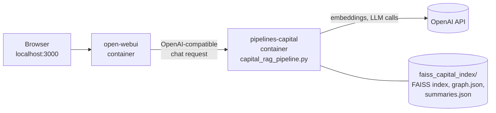
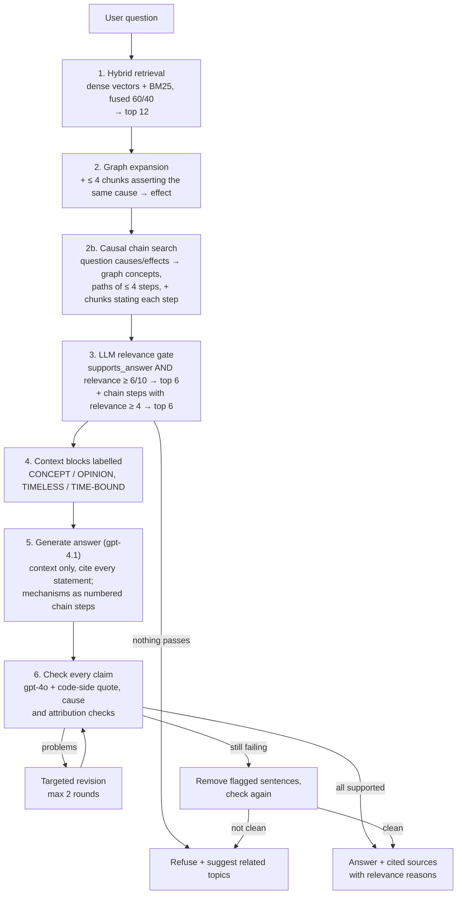
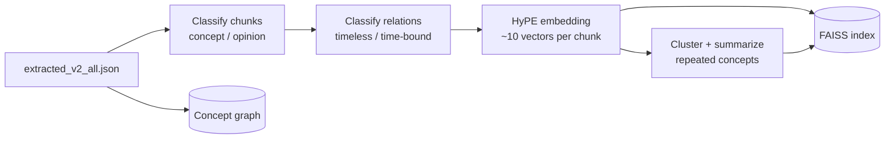

# Capital Markets RAG for Open WebUI

A retrieval-augmented chat model for [Open WebUI](https://github.com/open-webui/open-webui) that answers
questions about a capital-markets creator's videos **only from what the videos actually say**.

- 🔎 **Finds the real data:** several retrieval paths per passage (hypothetical-question vectors, BM25 keyword search,
  concept graph, cross-video summaries)
- ✅ **Shows only verified answers:** every factual statement must be backed by a verbatim quote from the sources,
  and Python code checks the quote, not just the LLM
- 🕰️ **Knows what goes stale:** timeless concepts are kept apart from time-bound opinions, and every opinion names the
  video it came from
- 🚫 **Refuses instead of guessing,** then suggests related topics it *can* answer

> **Deep-dive documentation**
> - [`docs/CAPITAL_RAG_PIPELINE.md`](docs/CAPITAL_RAG_PIPELINE.md): full reference (ingestion, workflow, fallbacks,
>   valves, operations, cost)
> - [`docs/CAPITAL_RAG_BEST_PRACTICES.md`](docs/CAPITAL_RAG_BEST_PRACTICES.md): architecture and every retrieval and
>   grounding practice, with code references, a test guide and open gaps

---

## Contents

- [Architecture](#architecture)
- [How a question is answered](#how-a-question-is-answered)
- [Ingestion: preparing the data](#ingestion-preparing-the-data)
- [Best practices for finding the real data](#best-practices-for-finding-the-real-data)
- [Hallucination defenses](#hallucination-defenses)
- [Fallbacks](#fallbacks)
- [Explorer mode](#explorer-mode)
- [Setup](#setup)
- [Configuration](#configuration)
- [Debugging](#debugging)
- [Repository layout](#repository-layout)
- [Known limitations](#known-limitations)

---

## Architecture


<sub>Generated by [`docs/architecture_diagram.py`](docs/architecture_diagram.py). Run `python docs/architecture_diagram.py` after changing the pipeline.</sub>



| Component | What it is |
|-----------|------------|
| `open-webui` (port 3000) | Chat UI. The pipeline appears in the model picker as **Capital Markets RAG** |
| `pipelines-capital` (internal port 9099, not published) | Open WebUI Pipelines server that loads [`pipelines-capital/capital_rag_pipeline.py`](pipelines-capital/capital_rag_pipeline.py) at startup |
| `pdfs/faiss_capital_index/` | Index built offline by [`pdfs/ingest_capital_chunks.py`](pdfs/ingest_capital_chunks.py), mounted at `/data` (git-ignored) |
| OpenAI | `text-embedding-3-large` for embeddings; `gpt-4o-mini` for grading and answering; `gpt-4o` for checking and revising |

The expensive reasoning about the corpus (classification, clustering, summaries, graph) is done **once at
ingestion**. At query time, LLM calls go only to the question: grading, answering and verifying.

---

## How a question is answered



1. **Hybrid retrieval:** 40 vector hits (cosine ≥ 0.35) and the top 40 BM25 chunks are each min-max normalized, then
   fused as `0.6·dense + 0.4·bm25`. The top 12 are kept.
2. **Graph expansion:** for the top 3 hits, other chunks that assert the same `(source → target, direction)`
   relation, usually from other videos, are added.
3. **Relevance gate:** each candidate is graded by an LLM with structured output. Only chunks that *directly help
   answer* **and** score ≥ 6/10 are kept, at most 5.
4. **Context:** each block is labelled as a timeless **CONCEPT** or a time-bound **OPINION** with its video. Its
   relations are tagged **TIMELESS** or **TIME-BOUND**.
5. **Generation:** the answer may use only the context, with no textbook knowledge. It must keep the source's degree
   of certainty, add no new cause → effect links, cite `[n]` everywhere and attribute every opinion to its video.
6. **Verification:** the answer is **not streamed**. It is checked claim by claim and only then shown. A live status
   line ("Durchsuche die Quellen …", "Prüfe jede Aussage gegen die Quellen …") covers the wait.

The output lists **only the sources the answer actually cites**, each marked *Konzept*, *Zusammenfassung* or
*Meinung (zeitgebunden)*, with the grader's reason for using it.

---

## Ingestion: preparing the data

The public site answers from `pdfs/faiss_public_index/` (the pipeline's default `INDEX_DIR`): German Wikipedia
articles (CC BY-SA 4.0), own explanatory texts and own cause -> effect chains (how a shock propagates step by step,
written by gpt-4.1), built by [`pdfs/build_public_kb.py`](pdfs/build_public_kb.py). The `normalize` stage maps all
concept names to canonical English names, so the concept graph links chunks of different sources for the chain search.
Use only sources you have the rights to publish; the private `faiss_capital_index` stays selectable via `INDEX_DIR`.

```sh
# 1. Wikipedia articles for the topic lists (free), check wiki_resolved.json, then metadata, own texts and
#    chains (~3-4 $ from scratch; unchanged chunks are reused from the previous build)
docker exec open-webui-pipelines-capital python /data/build_public_kb.py --stage fetch
docker exec open-webui-pipelines-capital python /data/build_public_kb.py --stage build
docker exec open-webui-pipelines-capital python /data/build_public_kb.py --stage normalize   # canonical concept names
# 2. Index, graph, summaries; long runs: start with systemd-run so they survive the SSH session
docker exec open-webui-pipelines-capital python /data/ingest_capital_chunks.py --index_dir /data/faiss_public_index
# 3. Start suggestions, licence page, reload
docker exec open-webui-pipelines-capital python /data/generate_start_suggestions.py --index_dir /data/faiss_public_index
docker exec -w /app/backend open-webui python /data/apply_start_suggestions.py --file /data/faiss_public_index/start_suggestions.json
#    or the three hand-picked questions shown on the public site (checked against the pipeline):
docker exec -w /app/backend open-webui python /data/apply_start_suggestions.py --file /data/start_suggestions_public.json
cp pdfs/faiss_public_index/lizenzen.html legal/lizenzen.html
docker restart open-webui-pipelines-capital
```

`build_public_kb.py` writes the chunk format of `extracted_v2_all.json` (`title`, `content`, `embedding_text`,
`hypothetical_questions`, `concepts`, `relations`, `sources`, ...) plus `lizenzen.html`, the attribution page Caddy
serves at `/lizenzen` (linked in the footer), as CC BY-SA requires. [`pdfs/eval_chains.py`](pdfs/eval_chains.py)
measures chain answers (15 fixed questions, LLM-judged steps / completeness / refusals) before and after a change. OpenAI limits gpt-4o-mini to 10,000 requests per
day on lower tiers, which the chat shares; pass `--llm_model` / `--model` to use another model's quota for a rebuild.



| Step | Details |
|------|---------|
| **Concept / opinion** | Evergreen explanation vs. forecast, positioning or market view. **Mixed chunks count as opinion**, because a stale view shown as timeless is the worse error. Cached by content hash. |
| **Relation class** | Each cause → effect relation is classified separately (one per request; batching proved unreliable), so a timeless mechanism inside an opinion chunk can still be stated generally. |
| **HyPE embedding** | Each chunk is embedded under its `embedding_text` **and each hypothetical question**. Every vector resolves to the full chunk. Cosine similarity (normalized inner product). |
| **Canonical summaries** | Concept chunks repeated across videos are clustered (agglomerative, cosine ≥ 0.73, measured on this corpus). Only clusters with ≥ 2 videos qualify, and opinions are never merged. Each cluster is summarized from the passages only, with disagreements stated. |
| **Concept graph** | Nodes = concepts, edges = `source → target (direction)` with the chunks that assert them. |

---

## Best practices for finding the real data

| Area | Practice | Why |
|------|----------|-----|
| **Recall** | HyPE: index the questions a passage answers | Question-to-question matching beats question-to-statement |
| | Max score over a chunk's vectors | One strong question match is enough |
| | Hybrid dense + BM25 with min-max fusion | Exact tickers and terms that embeddings blur |
| | German + English stopwords for BM25 | Stop function words from matching every chunk |
| | BM25 document includes the hypothetical questions | Keyword search also benefits from them |
| | Relation-level graph expansion | Brings in the same mechanism from other videos |
| | Cross-video canonical summaries | Complete explanations, less duplication in the context |
| **Precision** | Low similarity floor + capped candidate list | Noise filtered cheaply, recall kept |
| | LLM grade with *two* required conditions | Similarity is not relevance |
| | At most 5 graded chunks in the context | Less to drift on, meaningful citations |
| **Faithfulness** | Source-only prompt, no textbook knowledge | The most common RAG leak |
| | Verify before display | The user never sees an unchecked draft |
| | Claim decomposition by a stronger model | Catches what the answer model slipped in |
| | Deterministic quote, cause and attribution checks | The checker LLM is not trusted on its own |
| | Fail closed | No answer beats a wrong answer |
| **Time** | Concept/opinion + timeless/time-bound labels | Old forecasts are never presented as current facts |
| | Conflicting views shown side by side | No merged pseudo-consensus |
| **Engineering** | Pydantic structured outputs, temperature 0 | Reliable, reproducible decisions |
| | Model tiering (mini for bulk work, `gpt-4o` for checks) | Quality where errors are costly |
| | Content-hash caches, batch saves, rate-limit retries | Cheap, crash-safe re-ingestion |

Details, code references and a manual test guide: [`docs/CAPITAL_RAG_BEST_PRACTICES.md`](docs/CAPITAL_RAG_BEST_PRACTICES.md).

---

## Hallucination defenses

Hallucinations are handled at four levels: **prompt → LLM check → deterministic code check → control flow.**

**The claim check.** `gpt-4o` splits the answer into atomic, self-contained claims. Every "weil" / "because" is its
own claim, and pronouns are resolved. For each fact it returns a verbatim quote, the claim's cause, the quote's cause,
and the answer sentence it came from. Then Python code decides:

```text
quote must exist     normalized, ≥ 15 chars, exactly 1 sentence (2 only if the 2nd starts with
                     "sie/er/es/dies/it/this…"), exact match or ≥ 90 % fuzzy match
cause must match     claim_cause == quote_cause, otherwise "not stated in the sources"
no stitching         several real sentences glued into one claim → split, not delete
opinion attributed   quote from an OPINION block (and not a TIMELESS relation)
                     → the answer paragraph must name that video's title or id
```

**Why in code?** An LLM checker can invent a quote, stitch two sentences into a causal link, or lose "Im Video …"
when it rewrites a claim. String checks can't be talked into accepting those.

**Targeted revision.** Each problem type has its own fix: *delete* (and do not replace it with "the sources don't
say …", which is itself a new claim), *add the video title*, or *split the statements*. At most 2 rounds, each
re-checked. As a last resort only the flagged sentences are removed and the remainder is checked again.

**Example**

> Draft: "Sinkende Zinsen steigern die Nachfrage nach Anleihen [1]."
> Source [1]: "Wenn Investoren Vertrauen zurückgewinnen, … steigt die Nachfrage."
> → `claim_cause` "sinkende Zinsen" ≠ `quote_cause` "Vertrauen der Investoren" → removed.

---

## Fallbacks

| Situation | Behavior |
|-----------|----------|
| Index missing | The server still starts. Every question gets the ingestion command as its reply |
| `graph.json` missing | Graph expansion is disabled. Everything else works |
| No passage passes retrieval or grading | Refusal + verified related topics |
| A grading call fails | Only that chunk is skipped |
| Claims still unsupported after 2 revisions | Trim flagged sentences → re-check → otherwise refusal |
| **The check itself crashes** | **Refusal.** An unchecked answer is never shown |
| Answer only says "the sources don't cover this" | Shown, plus related topics |
| Background task (title, tags) fails | Returns `{}`, the chat is unaffected |
| `CHECK_ANSWER_GROUNDING = False` | Streams an *unchecked* answer, marked "(ungeprüft)". For debugging only |

---

## Explorer mode

Instead of a dead end, the pipeline suggests topics the videos **do** cover:

1. Concepts of the nearest chunks are scored by rank and boosted by their graph neighbors.
2. Only concepts that appear in ≥ 2 chunks are kept (no one-off mentions).
3. An LLM writes one question per topic that **its excerpt answers**.
4. Rephrasings of the user's question are removed (overlap weighted by BM25 IDF).
5. **Each suggestion is graded against its excerpt with the same relevance gate.**

Suggestions appear in the reply after a refusal and as clickable follow-up chips. After a normal answer, the pipeline
handles Open WebUI's follow-up background task itself, so the chips come from the data instead of being invented
by the model. Start-page suggestions are verified the same way
([`generate_start_suggestions.py`](pdfs/generate_start_suggestions.py) →
[`apply_start_suggestions.py`](pdfs/apply_start_suggestions.py)).

---

## Setup

```sh
cp .env.example .env                 # set OPENAI_API_KEY, PIPELINES_API_KEY, WEBUI_SECRET_KEY
docker compose up -d --build

# put extracted_v2_all.json into pdfs/faiss_capital_index/, then:
docker exec -it open-webui-pipelines-capital python /data/ingest_capital_chunks.py
docker restart open-webui-pipelines-capital
```

In Open WebUI (http://localhost:3000): **Admin Panel → Settings → Connections → OpenAI API → +**
with URL `http://pipelines-capital:9099` and the Pipelines API key (`PIPELINES_API_KEY` from `.env`). Then select **Capital Markets RAG** in the model picker.

Optional start-page suggestions:

```sh
docker exec open-webui-pipelines-capital python /data/generate_start_suggestions.py
docker exec -w /app/backend open-webui python /data/apply_start_suggestions.py
```

### Deploying to a VPS

Open WebUI only listens on `127.0.0.1:3000`. On a VPS, the `caddy` service (compose profile `vps`)
is the public entry point: it serves `WEBUI_URL` over HTTPS with an automatic Let's Encrypt
certificate and forwards to Open WebUI on the internal network ([`Caddyfile`](Caddyfile)).

1. Point the domain's DNS A/AAAA record at the VPS; open ports 22, 80 and 443 in the firewall.
2. In `.env` set `WEBUI_URL=https://your.domain`, `CORS_ALLOW_ORIGIN=https://your.domain` (no trailing slash),
   `ACME_EMAIL=<real address>` and `COMPOSE_PROFILES=vps`.
3. Copy `pdfs/faiss_capital_index/` (and optionally `open-webui-data/`) to the VPS, then run `docker compose up -d --build`.

**Open access without login (optional).** Caddy can sign every visitor in automatically as one shared guest
account with role `user` (no admin rights; guests share its chat history), while the admin account is only
reachable through an SSH tunnel:

1. As admin, create the guest account (Admin Panel → Users, role `user`) and make the models **Public**.
2. In the VPS `.env` set `WEBUI_AUTH_TRUSTED_EMAIL_HEADER=X-Webui-Email`, `GUEST_EMAIL=<guest account email>`,
   `ADMIN_EMAIL=<your admin email>` and append `;http://localhost:8081` to `CORS_ALLOW_ORIGIN`; then `docker compose up -d`.
3. Admin access: `ssh -L 8081:127.0.0.1:8081 <vps>`, then open `http://localhost:8081`.
4. Make it a plain anonymous chat: Admin Panel → Users → Groups → Default permissions: enable
   *Temporary Chat Enforced* (nothing saved, guests do not see each other's chats) and switch off what guests
   should not use (file upload, voice, chat controls/valves/system prompt, share/export/import, notes, channels,
   folders, memories, calendar, web search, image generation, code interpreter, interface settings).
   Caddy already rejects profile and password changes for the guest account, and serves [`guest.css`](guest.css)
   to visitors, which hides the user menu (settings, sign out) and the "You're now logged in" toast.

Set a spending limit on the OpenAI key: anyone can now use it through the chat.

**Site password.** Until the site has an Impressum and Datenschutzerklärung, Caddy shows a browser password
prompt before anything of Open WebUI loads. Set `SITE_USER` and `SITE_PASSWORD_HASH` (from
`docker exec caddy caddy hash-password --plaintext '<password>'`, in single quotes) in the VPS `.env`.
To open the site publicly, delete the `basic_auth` lines in the [`Caddyfile`](Caddyfile) and reload Caddy.

**Impressum and Datenschutzerklärung.** Caddy serves [`legal/impressum.html`](legal/impressum.html) at `/impressum`
and [`legal/datenschutz.html`](legal/datenschutz.html) at `/datenschutz`, also without the site password. Caddy inserts
a small permanent footer with both links into every Open WebUI page (bottom right); this needs the `replace-response`
plugin, which is why Caddy is built from [`Dockerfile.caddy`](Dockerfile.caddy). Keep the privacy policy in sync with the setup: hoster,
OpenAI, the browser storage it lists, temporary chats, and the 14-day log retention below.

**Log retention (14 days).** The logs contain visitor IP addresses and model output derived from chats. On the VPS
set `LOG_DRIVER=journald` in `.env` and limit the journal:

```bash
mkdir -p /etc/systemd/journald.conf.d
printf '[Journal]\nMaxRetentionSec=14day\nMaxFileSec=1day\n' > /etc/systemd/journald.conf.d/retention.conf
systemctl restart systemd-journald
docker compose up -d   # recreates the containers with the new log driver; docker logs keeps working
```

> Volume paths in `docker-compose.yaml` are relative to the project folder, so run `docker compose` from there.
> The compose file also starts a separate climate test pipeline; it is not part of this documentation.

---

## Configuration

Valves are edited in **Admin Panel → Settings → Pipelines**. The pipeline reloads automatically when they are saved.

| Valve | Default | Purpose |
|-------|---------|---------|
| `EMBEDDING_MODEL` | `text-embedding-3-large` | Must match the model used at ingestion |
| `LLM_MODEL` / `GRADER_MODEL` / `CHECK_MODEL` | `gpt-4o-mini` / `gpt-4o-mini` / `gpt-4o` | Answer / grading / verification |
| `FETCH_K` · `MIN_SIMILARITY` · `ALPHA` | 40 · 0.35 · 0.6 | Retrieval breadth, dense floor, dense weight |
| `CANDIDATE_K` · `GRAPH_SEED_K` · `GRAPH_EXPAND_K` | 12 · 3 · 4 | Candidate pool and graph expansion |
| `MIN_RELEVANCE` · `TOP_K` | 6 · 5 | Relevance gate and context size |
| `CHECK_ANSWER_GROUNDING` · `MAX_REVISIONS` | `True` · 2 | Claim check and revision rounds |
| `SHOW_THINKING_LOG` | `False` | Full step log including rejected claims in the chat |
| `EXPLORE_MODE` · `EXPLORE_SUGGESTIONS` · `EXPLORE_MIN_CHUNKS` | `True` · 4 · 2 | Related-topic suggestions |

**Tuning:**

- Too many refusals → turn on `SHOW_THINKING_LOG` first to see which stage rejects.
- Exact names or tickers missed → lower `ALPHA`.
- Off-topic candidates → raise `MIN_SIMILARITY`.

---

## Debugging

```sh
docker logs -f open-webui-pipelines-capital     # [capital_rag] lines: rejected claims, failures
```

When an answer is missing, find which stage is responsible:

- **Retrieval:** the right chunk never appears among the candidates.
- **Grading:** the chunk was found but rejected. Check its relevance score and reason.
- **Checking:** the claims were removed. The rejected claims are listed with the reason for each.

---

## Repository layout

| Path | Contents |
|------|----------|
| [`pipelines-capital/capital_rag_pipeline.py`](pipelines-capital/capital_rag_pipeline.py) | The query-time pipeline |
| [`pdfs/ingest_capital_chunks.py`](pdfs/ingest_capital_chunks.py) | Offline ingestion (classification, embedding, summaries, graph) |
| [`pdfs/generate_start_suggestions.py`](pdfs/generate_start_suggestions.py), [`pdfs/apply_start_suggestions.py`](pdfs/apply_start_suggestions.py) | Verified start-page questions |
| [`pdfs/build_public_kb.py`](pdfs/build_public_kb.py) | Builds the public knowledge base (Wikipedia + own texts) and the licence page |
| `pdfs/faiss_public_index/`, `pdfs/faiss_capital_index/` | Generated indexes and caches (git-ignored) |
| [`legal/`](legal/) | Impressum, Datenschutzerklärung, Lizenzen (served by Caddy) |
| [`all_rag_techniques_runnable_scripts/`](all_rag_techniques_runnable_scripts/) | Reference RAG techniques the pipeline is adapted from (HyPE, fusion, RAPTOR, reranking, graph RAG, …) |
| [`docs/`](docs/) | Detailed documentation |
| [`docker-compose.yaml`](docker-compose.yaml), `Dockerfile.*`, [`requirements.txt`](requirements.txt) | Container setup |
| [`CHANGELOG.md`](CHANGELOG.md) | Change history |

---

## Known limitations

- Retrieval uses only the latest message. Follow-ups like "und warum?" are not rewritten using the chat history.
- Status messages and the refusal text are in German. Answers follow the question's language.
- Grounding is lexical: a correct paraphrase spread over several source sentences may be rejected. This is intended:
  a false refusal is better than a false claim.
- There is no automated evaluation set yet.
- `index.pkl` is a pickle. Only load indexes you built yourself.

More, with suggested approaches: [`docs/CAPITAL_RAG_BEST_PRACTICES.md` §14](docs/CAPITAL_RAG_BEST_PRACTICES.md#14-not-implemented-yet).
