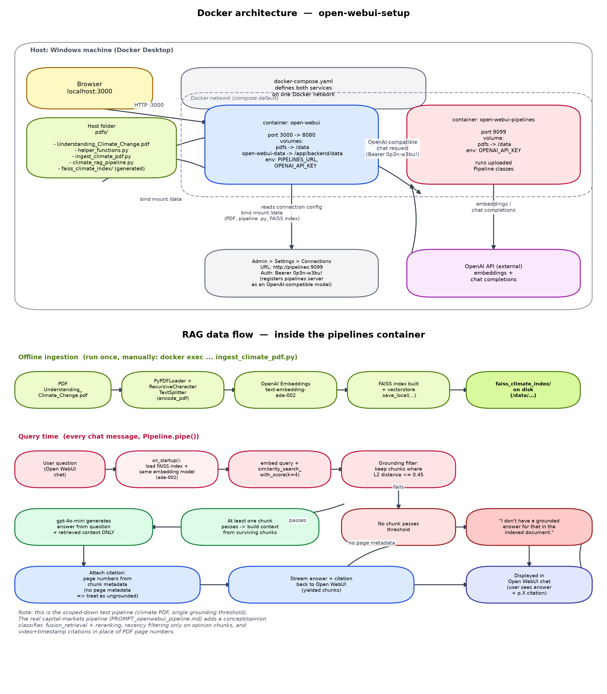
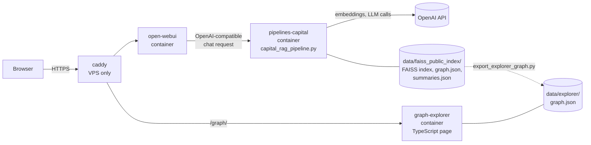
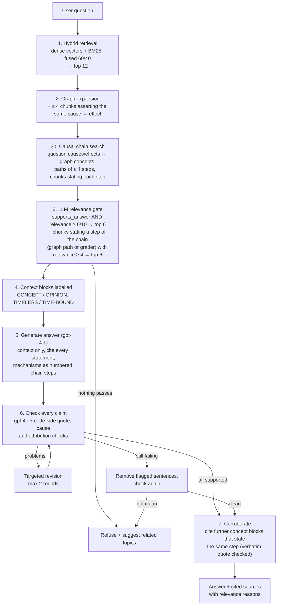
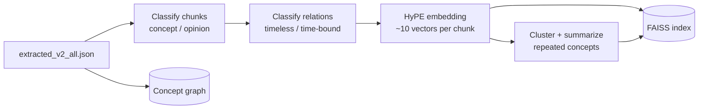
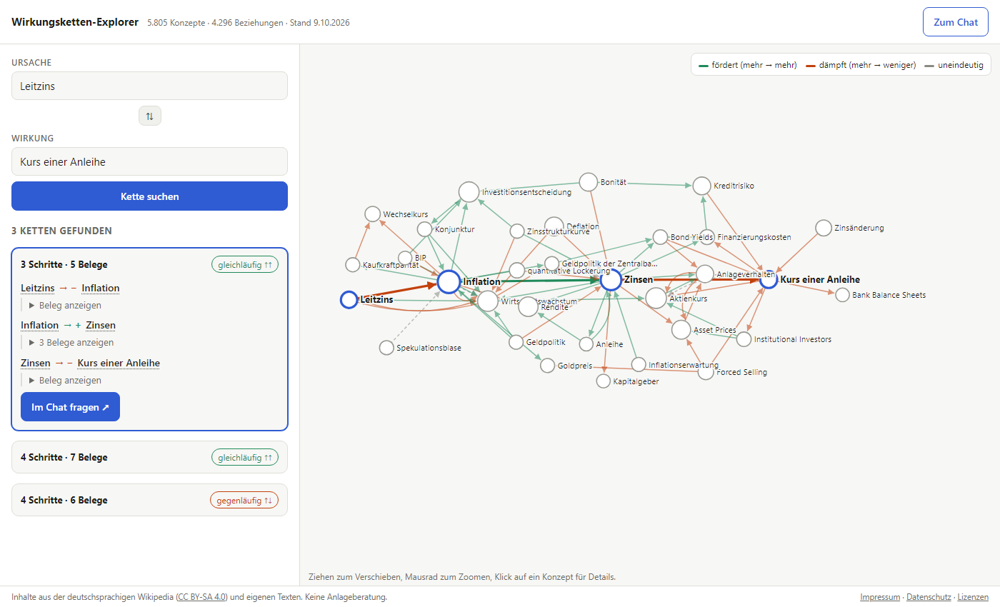
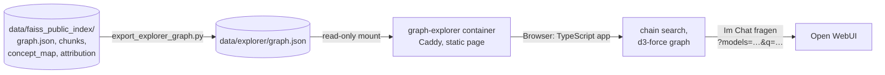

# Capital Markets RAG for Open WebUI

A retrieval-augmented chat model for [Open WebUI](https://github.com/open-webui/open-webui) that explains
**cause → effect chains on the capital markets** (how a rate decision, an oil shock or a crash propagates through
markets, step by step) **only from what its sources actually say**. It runs publicly at https://mjoelnir.ai, with a
[graph explorer](https://mjoelnir.ai/graph/#von=Leitzins&nach=Bond+Price) that shows the chains in the concept graph.

The public knowledge base consists of German Wikipedia articles (CC BY-SA 4.0), own explanatory texts and own
cause → effect chain texts (see [Ingestion](#ingestion-preparing-the-data)). The same pipeline can also run on a
private corpus, such as transcribed videos (`faiss_capital_index`).

- 🔗 **Follows chains across sources:** causal chain search through a concept graph, chain steps backed by several
  sources, each step cited
- 🔎 **Finds the real data:** several retrieval paths per passage (hypothetical-question vectors, BM25 keyword search,
  concept graph, summaries across sources)
- ✅ **Shows only verified answers:** every factual statement must be backed by a verbatim quote from the sources,
  and Python code checks the quote, not just the LLM
- 🕰️ **Knows what goes stale:** timeless concepts are kept apart from time-bound opinions, and every opinion names the
  source it came from
- 🚫 **Refuses instead of guessing,** then suggests related topics it *can* answer
- 🕸️ **Makes the chains visible:** a TypeScript [graph explorer](#graph-explorer-typescript) finds the cause → effect
  chains between two concepts, shows the source sentence of every step and hands the chain to the chat as a question

> **Deep-dive documentation**
> - [`docs/CAPITAL_RAG_PIPELINE.md`](docs/CAPITAL_RAG_PIPELINE.md): full reference (ingestion, workflow, fallbacks,
>   valves, operations, cost)
> - [`docs/CAPITAL_RAG_BEST_PRACTICES.md`](docs/CAPITAL_RAG_BEST_PRACTICES.md): architecture and every retrieval and
>   grounding practice, with code references, a test guide and open gaps

---

## Contents

- [Architecture](#architecture)
- [How a question is answered](#how-a-question-is-answered)
- [Ingestion: preparing the data](#ingestion-preparing-the-data)
- [Best practices for finding the real data](#best-practices-for-finding-the-real-data)
- [Hallucination defenses](#hallucination-defenses)
- [Fallbacks](#fallbacks)
- [Explorer mode](#explorer-mode)
- [Graph explorer (TypeScript)](#graph-explorer-typescript)
- [Setup](#setup)
- [Configuration](#configuration)
- [Debugging](#debugging)
- [Repository layout](#repository-layout)
- [Known limitations](#known-limitations)

---

## Architecture



<sub>Generated by [`docs/architecture_diagram.py`](docs/architecture_diagram.py). Run `python docs/architecture_diagram.py` after changing the pipeline.</sub>



| Component | What it is |
|-----------|------------|
| `caddy` (ports 80/443, VPS only) | HTTPS entry point: certificate, guest sign-in, legal pages and footer ([`Caddyfile`](Caddyfile)) |
| `open-webui` (port 3000, localhost only) | Chat UI. The pipeline appears in the model picker as **Capital Markets RAG** |
| `graph-explorer` (port 3001, localhost only; `/graph/` on the VPS) | TypeScript page for exploring the concept graph ([`graph-explorer/`](graph-explorer/), see [Graph explorer](#graph-explorer-typescript)) |
| `pipelines-capital` (internal port 9099, not published) | Open WebUI Pipelines server that loads [`pipelines-capital/capital_rag_pipeline.py`](pipelines-capital/capital_rag_pipeline.py) at startup |
| `data/` | Knowledge base and eval scripts plus the generated indexes (`faiss_public_index/`, optionally `faiss_capital_index/`, git-ignored), mounted at `/data` |
| OpenAI | `text-embedding-3-large` for embeddings; `gpt-4.1` for answers; `gpt-4.1-mini` for grading and question concepts; `gpt-4o` for checking, revising and corroborating |

The expensive reasoning about the corpus (classification, clustering, summaries, graph) is done **once at
ingestion**. At query time, LLM calls go only to the question: grading, answering and verifying.

---

## How a question is answered



1. **Hybrid retrieval:** 40 vector hits (cosine ≥ 0.35) and the top 40 BM25 chunks are each min-max normalized, then
   fused as `0.6·dense + 0.4·bm25`. The top 12 are kept.
2. **Graph expansion:** for the top 3 hits, other chunks that assert the same `(source → target, direction)`
   relation, usually from other sources, are added.
   **Causal chain search:** the question's causes and effects are matched to graph concepts, and directed paths of up
   to 4 steps between them are followed; the chunks stating each step join the candidates.
3. **Relevance gate:** each candidate is graded by an LLM with structured output. Chunks that *directly help
   answer* **and** score ≥ 6/10 are kept (at most 6). Chunks that state a single step of the asked chain (found on a
   graph path or marked by the grader) are kept from 4/10 (at most 6 more), so a chain can be built from several
   sources.
4. **Context:** each block is labelled as a timeless **CONCEPT** or a time-bound **OPINION** with its source. Its
   relations are tagged **TIMELESS** or **TIME-BOUND**.
5. **Generation:** the answer may use only the context, with no textbook knowledge. It must keep the source's degree
   of certainty, add no new cause → effect links, cite `[n]` everywhere and attribute every opinion to its source.
   Mechanism questions are answered as numbered chain steps, each with its own citation.
6. **Verification:** the answer is **not streamed**. It is checked claim by claim and only then shown. A live status
   line ("Durchsuche die Quellen …", "Prüfe jede Aussage gegen die Quellen …") covers the wait.
7. **Corroboration:** a step one block covers is often stated by other blocks too. gpt-4o names them with a verbatim
   quote per answer line; the code accepts a block only if the quote really is in that block, the line already
   cites a source and the block is a concept block. Its number is then added to that line (`[1][3]`), so a chain
   shows all the sources that back it instead of only the one chain text that covers the most.

The output lists **only the sources the answer actually cites**, each marked *Konzept*, *Zusammenfassung* or
*Meinung (zeitgebunden)*, with the grader's reason for using it.

---

## Ingestion: preparing the data

The public site answers from `data/faiss_public_index/` (the pipeline's default `INDEX_DIR`): German Wikipedia
articles (CC BY-SA 4.0), own explanatory texts and own cause -> effect chains (how a shock propagates step by step,
written by gpt-4.1), built by [`data/build_public_kb.py`](data/build_public_kb.py). The `normalize` stage maps all
concept names to canonical English names, so the concept graph links chunks of different sources for the chain search.
Use only sources you have the rights to publish. A private corpus (e.g. video transcripts as `extracted_v2_all.json`
in `data/faiss_capital_index/`) is indexed with the same `ingest_capital_chunks.py` and selected via `INDEX_DIR`.

```sh
# 1. Wikipedia articles for the topic lists (free), check wiki_resolved.json, then metadata, own texts and
#    chains (~3-4 $ from scratch; unchanged chunks are reused from the previous build)
docker exec open-webui-pipelines-capital python /data/build_public_kb.py --stage fetch
docker exec open-webui-pipelines-capital python /data/build_public_kb.py --stage build
docker exec open-webui-pipelines-capital python /data/build_public_kb.py --stage normalize   # canonical concept names
# 2. Index, graph, summaries; long runs: start with systemd-run so they survive the SSH session
docker exec open-webui-pipelines-capital python /data/ingest_capital_chunks.py --index_dir /data/faiss_public_index
# 3. Start suggestions, licence page, reload
docker exec open-webui-pipelines-capital python /data/generate_start_suggestions.py --index_dir /data/faiss_public_index
docker exec -w /app/backend open-webui python /data/apply_start_suggestions.py --file /data/faiss_public_index/start_suggestions.json
#    or the three hand-picked questions shown on the public site (checked against the pipeline), with the
#    links Open WebUI shows under the model name: the repository, and in the line below the graph explorer with an
#    example chain (guest.css turns it into a button):
docker exec -w /app/backend open-webui python /data/apply_start_suggestions.py --file /data/start_suggestions_public.json \
  --description "$(printf '%s\n%s' '[github.com/HaukeHoppe/MjoelnirAI](https://github.com/HaukeHoppe/MjoelnirAI)' \
    '**[🔗 Wirkungsketten-Explorer: Leitzins → Kurs einer Anleihe](/graph/#von=Leitzins&nach=Bond+Price)**')"
#    locally the explorer is at http://localhost:3001/; --keep_suggestions changes only the description.
cp data/faiss_public_index/lizenzen.html legal/lizenzen.html
docker restart open-webui-pipelines-capital
```

`build_public_kb.py` writes the chunk format of `extracted_v2_all.json` (`title`, `content`, `embedding_text`,
`hypothetical_questions`, `concepts`, `relations`, `sources`, ...) plus `lizenzen.html`, the attribution page Caddy
serves at `/lizenzen` (linked in the footer), as CC BY-SA requires. Pass `--llm_model` / `--model` to use another
model's daily request quota for a rebuild than the one the chat uses.

[`data/eval_chains.py`](data/eval_chains.py) measures chain answers before and after a change: 15 tuning questions
(`--set tuning`) or 20 held-out questions plus 3 control questions that must be refused (`--set validation`). An LLM
judges chain steps, completeness, depth and refusals; the script also counts the sources each answer cites.



| Step | Details |
|------|---------|
| **Concept / opinion** | Evergreen explanation vs. forecast, positioning or market view. **Mixed chunks count as opinion**, because a stale view shown as timeless is the worse error. Cached by content hash. |
| **Relation class** | Each cause → effect relation is classified separately (one per request; batching proved unreliable), so a timeless mechanism inside an opinion chunk can still be stated generally. |
| **HyPE embedding** | Each chunk is embedded under its `embedding_text` **and each hypothetical question**. Every vector resolves to the full chunk. Cosine similarity (normalized inner product). |
| **Canonical summaries** | Concept chunks repeated across sources are clustered (agglomerative, cosine ≥ 0.73). Only clusters with ≥ 2 sources qualify, and opinions are never merged. Each cluster is summarized from the passages only, with disagreements stated. |
| **Concept graph** | Nodes = concepts, edges = `source → target (direction)` with the chunks that assert them. |

---

## Best practices for finding the real data

| Area | Practice | Why |
|------|----------|-----|
| **Recall** | HyPE: index the questions a passage answers | Question-to-question matching beats question-to-statement |
| | Max score over a chunk's vectors | One strong question match is enough |
| | Hybrid dense + BM25 with min-max fusion | Exact tickers and terms that embeddings blur |
| | German + English stopwords for BM25 | Stop function words from matching every chunk |
| | BM25 document includes the hypothetical questions | Keyword search also benefits from them |
| | Relation-level graph expansion | Brings in the same mechanism from other sources |
| | Causal chain search over the concept graph | Multi-step chains whose steps are stated in different sources |
| | Canonical summaries across sources | Complete explanations, less duplication in the context |
| **Precision** | Low similarity floor + capped candidate list | Noise filtered cheaply, recall kept |
| | LLM grade with *two* required conditions | Similarity is not relevance |
| | At most 6 graded chunks + 6 chain-step chunks in the context | Less to drift on, meaningful citations |
| **Faithfulness** | Source-only prompt, no textbook knowledge | The most common RAG leak |
| | Verify before display | The user never sees an unchecked draft |
| | Claim decomposition by a stronger model | Catches what the answer model slipped in |
| | Deterministic quote, cause and attribution checks | The checker LLM is not trusted on its own |
| | Fail closed | No answer beats a wrong answer |
| | Corroboration with verified quotes | A chain step shows every source that states it |
| **Time** | Concept/opinion + timeless/time-bound labels | Old forecasts are never presented as current facts |
| | Conflicting views shown side by side | No merged pseudo-consensus |
| **Engineering** | Pydantic structured outputs, temperature 0 | Reliable, reproducible decisions |
| | Model tiering (`gpt-4.1-mini` for grading, `gpt-4.1` for answers, `gpt-4o` for checks) | Quality where errors are costly |
| | Content-hash caches, batch saves, rate-limit retries | Cheap, crash-safe re-ingestion |

Details, code references and a manual test guide: [`docs/CAPITAL_RAG_BEST_PRACTICES.md`](docs/CAPITAL_RAG_BEST_PRACTICES.md).

---

## Hallucination defenses

Hallucinations are handled at four levels: **prompt → LLM check → deterministic code check → control flow.**

**The claim check.** `gpt-4o` splits the answer into atomic, self-contained claims. Every "weil" / "because" is its
own claim, and pronouns are resolved. For each fact it returns a verbatim quote, the claim's cause, the quote's cause,
and the answer sentence it came from. Then Python code decides:

```text
quote must exist     normalized, ≥ 15 chars, exactly 1 sentence (2 only if the 2nd starts with
                     "sie/er/es/dies/it/this…"), exact match or ≥ 90 % fuzzy match
cause must match     claim_cause == quote_cause, otherwise "not stated in the sources"
no stitching         several real sentences glued into one claim → split, not delete
opinion attributed   quote from an OPINION block (and not a TIMELESS relation)
                     → the answer paragraph must name that source's title or id
```

**Why in code?** An LLM checker can invent a quote, stitch two sentences into a causal link, or lose the source
attribution ("Laut …") when it rewrites a claim. String checks can't be talked into accepting those.

**Targeted revision.** Each problem type has its own fix: *delete* (and do not replace it with "the sources don't
say …", which is itself a new claim), *add the source title*, or *split the statements*. At most 2 rounds, each
re-checked. As a last resort only the flagged sentences are removed and the remainder is checked again.

**Example**

> Draft: "Sinkende Zinsen steigern die Nachfrage nach Anleihen [1]."
> Source [1]: "Wenn Investoren Vertrauen zurückgewinnen, … steigt die Nachfrage."
> → `claim_cause` "sinkende Zinsen" ≠ `quote_cause` "Vertrauen der Investoren" → removed.

---

## Fallbacks

| Situation | Behavior |
|-----------|----------|
| Index missing | The server still starts. Every question gets the ingestion command as its reply |
| `graph.json` missing | Graph expansion is disabled. Everything else works |
| No passage passes retrieval or grading | Refusal + verified related topics |
| A grading call fails | Only that chunk is skipped |
| Claims still unsupported after 2 revisions | Trim flagged sentences → re-check → otherwise refusal |
| **The check itself crashes** | **Refusal.** An unchecked answer is never shown |
| Answer only says "the sources don't cover this" | Shown, plus related topics |
| Background task (title, tags) fails | Returns `{}`, the chat is unaffected |
| `CHECK_ANSWER_GROUNDING = False` | Streams an *unchecked* answer, marked "(ungeprüft)". For debugging only |

---

## Explorer mode

Instead of a dead end, the pipeline suggests topics the sources **do** cover:

1. Concepts of the nearest chunks are scored by rank and boosted by their graph neighbors.
2. Only concepts that appear in ≥ 2 chunks are kept (no one-off mentions).
3. An LLM writes one question per topic that **its excerpt answers**.
4. Rephrasings of the user's question are removed (overlap weighted by BM25 IDF).
5. **Each suggestion is graded against its excerpt with the same relevance gate.**

Suggestions appear in the reply after a refusal and as clickable follow-up chips. After a normal answer, the pipeline
handles Open WebUI's follow-up background task itself, so the chips come from the data instead of being invented
by the model. Start-page suggestions are verified the same way
([`generate_start_suggestions.py`](data/generate_start_suggestions.py) →
[`apply_start_suggestions.py`](data/apply_start_suggestions.py)).

---

## Graph explorer (TypeScript)

[`graph-explorer/`](graph-explorer/) is a browser page that makes the concept graph behind the chain search visible:
pick a cause and an effect and it shows the cause → effect chains between them (at most 4 steps), the net direction
of each chain, and for every step the sentence from the sources that states it, with a link to the source.
"Im Chat fragen" opens the chat with the chain as a question. Without a chain it offers the effects of the cause
and the causes of the effect as next choices. Locally it runs at http://localhost:3001, on the VPS at `/graph/`
([example: Leitzins → Kurs einer Anleihe](https://mjoelnir.ai/graph/#von=Leitzins&nach=Bond+Price)); the start page of
the chat links it under the model name.





- **Data:** [`data/export_explorer_graph.py`](data/export_explorer_graph.py) writes `data/explorer/graph.json`
  (git-ignored): concepts with a German label, every relation with its evidence, and title, source and Wikipedia link
  of each evidence chunk. It only exports the public index, because the file is published.
- **Chain search** ([`src/graph.ts`](graph-explorer/src/graph.ts)): a backward BFS gives every concept its distance to
  the effect, then a depth-first search enumerates simple paths that can still reach it in the steps left, shortest
  and best supported first. The direction of a chain is the product of its step signs (more → less → less = more).
- **Code:** strict TypeScript, no UI framework; `src/parse.ts` validates `graph.json` at runtime and names the
  offending field, `src/view.ts` draws with d3-force, `src/main.ts` holds the UI state (mirrored in the URL hash).
  The Docker build runs the type check and the unit tests ([`src/graph.test.ts`](graph-explorer/src/graph.test.ts)).

```sh
python data/export_explorer_graph.py               # after every ingestion
docker compose up -d --build graph-explorer         # http://localhost:3001

cd graph-explorer && npm install
npm run dev                                         # dev server, reads ../data/explorer/graph.json
npm test                                            # unit tests (vitest)
```

---

## Setup

```sh
cp .env.example .env                 # set OPENAI_API_KEY, PIPELINES_API_KEY, WEBUI_SECRET_KEY
docker compose up -d --build
# then build the knowledge base and index as in "Ingestion" above (data/faiss_public_index/)
```

In Open WebUI (http://localhost:3000): **Admin Panel → Settings → Connections → OpenAI API → +**
with URL `http://pipelines-capital:9099` and the Pipelines API key (`PIPELINES_API_KEY` from `.env`). Then select **Capital Markets RAG** in the model picker.

Start-page suggestions: see step 3 in [Ingestion](#ingestion-preparing-the-data).

### Deploying to a VPS

Open WebUI only listens on `127.0.0.1:3000`. On a VPS, the `caddy` service (compose profile `vps`)
is the public entry point: it serves `WEBUI_URL` over HTTPS with an automatic Let's Encrypt
certificate and forwards to Open WebUI on the internal network ([`Caddyfile`](Caddyfile)).

1. Point the domain's DNS A/AAAA record at the VPS; open ports 22, 80 and 443 in the firewall.
2. In `.env` set `WEBUI_URL=https://your.domain`, `CORS_ALLOW_ORIGIN=https://your.domain` (no trailing slash),
   `ACME_EMAIL=<real address>` and `COMPOSE_PROFILES=vps`.
3. Copy the project folder to the VPS (without `.env`, which is created there), run `docker compose up -d --build`,
   then build the index there or copy `data/faiss_public_index/` along (and optionally `open-webui-data/`).
4. Graph explorer: set `GRAPH_CHAT_URL=/` in `.env`, run `python data/export_explorer_graph.py` (or copy
   `data/explorer/` along) and `docker compose up -d graph-explorer`; Caddy serves it at `/graph/`.

**Open access without login (optional).** Caddy can sign every visitor in automatically as one shared guest
account with role `user` (no admin rights; guests share its chat history), while the admin account is only
reachable through an SSH tunnel:

1. As admin, create the guest account (Admin Panel → Users, role `user`) and make the models **Public**.
2. In the VPS `.env` set `WEBUI_AUTH_TRUSTED_EMAIL_HEADER=X-Webui-Email`, `GUEST_EMAIL=<guest account email>`,
   `ADMIN_EMAIL=<your admin email>` and append `;http://localhost:8081` to `CORS_ALLOW_ORIGIN`; then `docker compose up -d`.
3. Admin access: `ssh -L 8081:127.0.0.1:8081 <vps>`, then open `http://localhost:8081`.
4. Make it a plain anonymous chat: Admin Panel → Users → Groups → Default permissions: enable
   *Temporary Chat Enforced* (nothing saved, guests do not see each other's chats) and switch off what guests
   should not use (file upload, voice, chat controls/valves/system prompt, share/export/import, notes, channels,
   folders, memories, calendar, web search, image generation, code interpreter, interface settings).
   Caddy already rejects profile and password changes for the guest account, and serves [`guest.css`](guest.css)
   to visitors, which hides the user menu (settings, sign out) and the "You're now logged in" toast.

Set a spending limit on the OpenAI key: anyone can now use it through the chat.

**Public access.** The site is open to everyone, without a password prompt: Caddy signs every visitor in as the
guest account. To lock it again, put a `basic_auth` block in front of the site in the [`Caddyfile`](Caddyfile)
(exempting `/impressum`, `/datenschutz` and `/lizenzen`, which must stay reachable) and reload Caddy.

**Impressum and Datenschutzerklärung.** Caddy serves [`legal/impressum.html`](legal/impressum.html) at `/impressum`
and [`legal/datenschutz.html`](legal/datenschutz.html) at `/datenschutz`. Caddy inserts
a small permanent footer with both links into every Open WebUI page (bottom right); this needs the `replace-response`
plugin, which is why Caddy is built from [`Dockerfile.caddy`](Dockerfile.caddy). Keep the privacy policy in sync with the setup: hoster,
OpenAI, the browser storage it lists, temporary chats, and the 14-day log retention below.

**Log retention (14 days).** The logs contain visitor IP addresses and model output derived from chats. On the VPS
set `LOG_DRIVER=journald` in `.env` and limit the journal:

```bash
mkdir -p /etc/systemd/journald.conf.d
printf '[Journal]\nMaxRetentionSec=14day\nMaxFileSec=1day\n' > /etc/systemd/journald.conf.d/retention.conf
systemctl restart systemd-journald
docker compose up -d   # recreates the containers with the new log driver; docker logs keeps working
```

> Volume paths in `docker-compose.yaml` are relative to the project folder, so run `docker compose` from there.

---

## Configuration

Valves are edited in **Admin Panel → Settings → Pipelines**. The pipeline reloads automatically when they are saved.

| Valve | Default | Purpose |
|-------|---------|---------|
| `INDEX_DIR` | `/data/faiss_public_index` | Index the pipeline loads (`/data/faiss_capital_index` for a private corpus) |
| `EMBEDDING_MODEL` | `text-embedding-3-large` | Must match the model used at ingestion |
| `LLM_MODEL` / `GRADER_MODEL` / `CHECK_MODEL` | `gpt-4.1` / `gpt-4.1-mini` / `gpt-4o` | Answer / grading and question concepts / verification, revision, corroboration |
| `FETCH_K` · `MIN_SIMILARITY` · `ALPHA` | 40 · 0.35 · 0.6 | Retrieval breadth, dense floor, dense weight |
| `CANDIDATE_K` · `GRAPH_SEED_K` · `GRAPH_EXPAND_K` | 12 · 3 · 4 | Candidate pool and graph expansion |
| `MIN_RELEVANCE` · `TOP_K` | 6 · 6 | Relevance gate and context size |
| `CHAIN_SEARCH` · `CHAIN_MAX_HOPS` · `CHAIN_PATHS` · `CHAIN_EXTRA_K` | `True` · 4 · 3 · 8 | Causal chain search: on/off, steps per path, paths, extra chunks |
| `CHAIN_TOP_K` · `CHAIN_MIN_RELEVANCE` · `CONCEPT_MIN_SIMILARITY` | 6 · 4 · 0.55 | Chain-step chunks in the context, their relevance bar, question-to-concept matching |
| `CHECK_ANSWER_GROUNDING` · `MAX_REVISIONS` | `True` · 2 | Claim check and revision rounds |
| `CORROBORATE` · `CORROBORATE_MAX_PER_LINE` | `True` · 2 | After the check, cite further blocks stating the same step |
| `SHOW_THINKING_LOG` | `False` | Full step log including rejected claims in the chat |
| `EXPLORE_MODE` · `EXPLORE_SUGGESTIONS` · `EXPLORE_MIN_CHUNKS` | `True` · 4 · 2 | Related-topic suggestions |

**Tuning:**

- Too many refusals → turn on `SHOW_THINKING_LOG` first to see which stage rejects.
- Exact names or tickers missed → lower `ALPHA`.
- Off-topic candidates → raise `MIN_SIMILARITY`.

---

## Debugging

```sh
docker logs -f open-webui-pipelines-capital     # [capital_rag] lines: rejected claims, failures
```

When an answer is missing, find which stage is responsible:

- **Retrieval:** the right chunk never appears among the candidates.
- **Grading:** the chunk was found but rejected. Check its relevance score and reason.
- **Checking:** the claims were removed. The rejected claims are listed with the reason for each.

---

## Repository layout

| Path | Contents |
|------|----------|
| [`pipelines-capital/capital_rag_pipeline.py`](pipelines-capital/capital_rag_pipeline.py) | The query-time pipeline |
| [`data/ingest_capital_chunks.py`](data/ingest_capital_chunks.py) | Offline ingestion (classification, embedding, summaries, graph) |
| [`data/generate_start_suggestions.py`](data/generate_start_suggestions.py), [`data/apply_start_suggestions.py`](data/apply_start_suggestions.py) | Verified start-page questions |
| [`data/build_public_kb.py`](data/build_public_kb.py) | Builds the public knowledge base (Wikipedia + own texts) and the licence page |
| [`data/export_explorer_graph.py`](data/export_explorer_graph.py) | Exports the concept graph for the graph explorer to `data/explorer/` (git-ignored) |
| `data/faiss_public_index/`, `data/faiss_capital_index/` | Generated indexes and caches (git-ignored) |
| [`graph-explorer/`](graph-explorer/) | Graph explorer: TypeScript app, its tests, Dockerfile and Caddyfile |
| [`legal/`](legal/) | Impressum, Datenschutzerklärung, Lizenzen (served by Caddy) |
| `all_rag_techniques_runnable_scripts/` | Reference RAG techniques the pipeline is adapted from (HyPE, fusion, RAPTOR, reranking, graph RAG, …); third-party code, kept locally, not in the repository |
| [`docs/`](docs/) | Detailed documentation |
| [`docker-compose.yaml`](docker-compose.yaml), `Dockerfile.*`, [`requirements.txt`](requirements.txt) | Container setup |

---

## Known limitations

- Retrieval uses only the latest message. Follow-ups like "und warum?" are not rewritten using the chat history.
- Status messages and the refusal text are in German. Answers follow the question's language.
- Grounding is lexical: a correct paraphrase spread over several source sentences may be rejected. This is intended:
  a false refusal is better than a false claim.
- The evaluation ([`data/eval_chains.py`](data/eval_chains.py)) is judged by an LLM on 35 questions; scores vary
  between runs, so small differences are noise.
- The concept graph is sparse (most concept names occur once), so the chain search finds paths for only some
  questions; chains are mostly built from the chain texts and the grader's step chunks.
- `index.pkl` is a pickle. Only load indexes you built yourself.

More, with suggested approaches: [`docs/CAPITAL_RAG_BEST_PRACTICES.md` §14](docs/CAPITAL_RAG_BEST_PRACTICES.md#14-not-implemented-yet).
