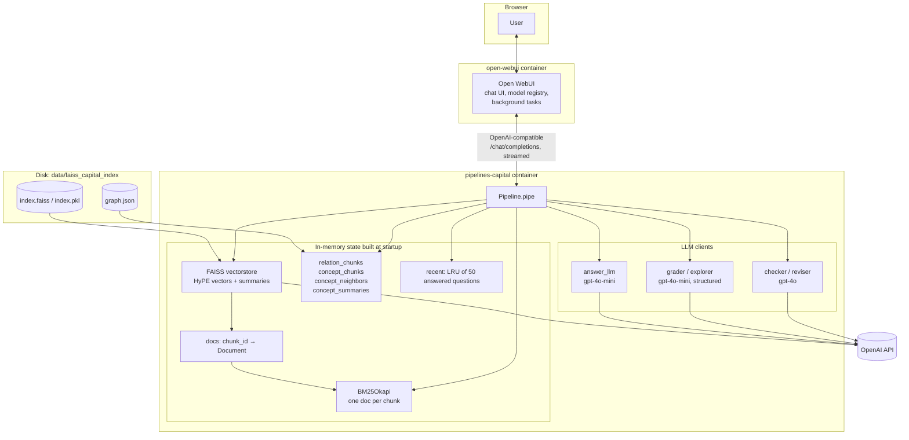
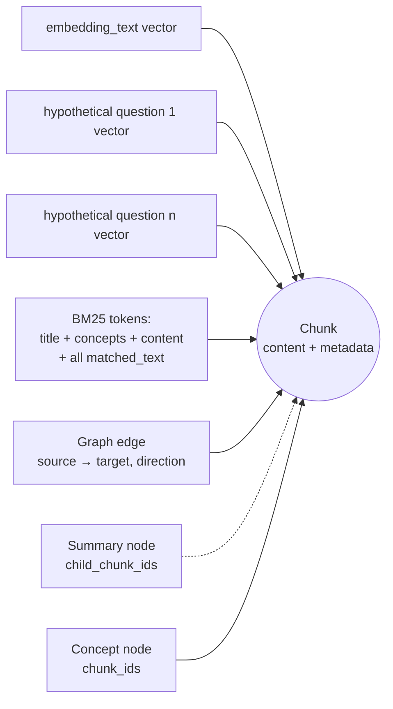
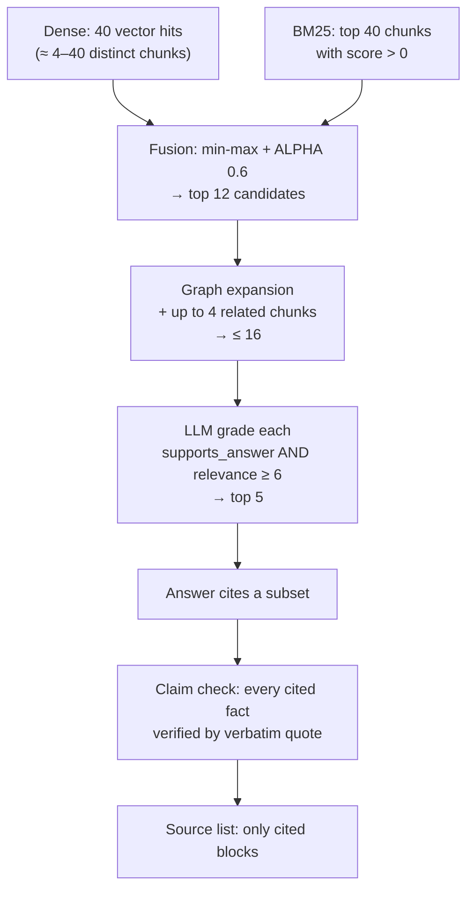

# Capital Markets RAG: Architecture and Best Practices

This document explains **how the Capital Markets RAG pipeline finds the real data and makes sure
only real data reaches the user.** For each practice it gives the problem it solves, how it is
implemented (with code references), the parameter that controls it, and the trade-off.

For the reference-style overview (valves, operations, cost), see
[`CAPITAL_RAG_PIPELINE.md`](CAPITAL_RAG_PIPELINE.md).

---

## Contents

1. [Design principle](#1-design-principle)
2. [System architecture](#2-system-architecture)
3. [The data model: one chunk, many access paths](#3-the-data-model-one-chunk-many-access-paths)
4. [The retrieval funnel](#4-the-retrieval-funnel)
5. [Part A: Finding the real data (recall)](#part-a-finding-the-real-data-recall)
6. [Part B: Keeping only the real data (precision)](#part-b-keeping-only-the-real-data-precision)
7. [Part C: Saying only what the data says (faithfulness)](#part-c-saying-only-what-the-data-says-faithfulness)
8. [Part D: Time awareness: opinions vs. facts](#part-d-time-awareness-opinions-vs-facts)
9. [Part E: Transparency and user guidance](#part-e-transparency-and-user-guidance)
10. [Part F: Engineering and robustness practices](#part-f-engineering-and-robustness-practices)
11. [End-to-end trace](#11-end-to-end-trace)
12. [How to verify it finds the real data](#12-how-to-verify-it-finds-the-real-data)
13. [Best-practice checklist](#13-best-practice-checklist)
14. [Not implemented yet](#14-not-implemented-yet)

---

## 1. Design principle

The pipeline answers questions from one creator's capital-markets videos. Every design decision serves
one of three goals:

| Goal | Question it answers | Main mechanisms |
|------|---------------------|-----------------|
| **Recall** | Did we find every passage that answers the question? | HyPE vectors, BM25, fusion, graph expansion, summaries |
| **Precision** | Did we keep only passages that really answer it? | Similarity floor, LLM grading with a hard relevance gate |
| **Faithfulness** | Does the answer say only what those passages say? | Strict prompt, claim-level check, code-side quote, cause and attribution verification, refusal |

The order matters. Recall is pushed high first: several retrievers, many candidates, graph neighbors.
After that, every step only removes material (grading, claim checks, trimming). **No later step can add a
fact that was not in the retrieved passages.** If nothing survives, the pipeline refuses and points to
related topics that are covered.

---

## 2. System architecture

### 2.1 Runtime components



### 2.2 Code map

| Concern | Code |
|---------|------|
| Load index, BM25, graph, LLM clients | `Pipeline._load`, `_build_keyword_index`, `_load_graph` (`pipelines-capital/capital_rag_pipeline.py:435-509`) |
| Hybrid retrieval | `_fusion_candidates` (`:512`) |
| Graph expansion | `_graph_expand` (`:538`) |
| Relevance gate | `_grade` (`:552`) |
| Answer → check → revise → trim | `_grounded_answer` (`:728`), `_unsupported_claims` (`:697`) |
| Deterministic verifiers | `quote_in_context` (`:209`), `joins_sentences` (`:230`), `required_videos` (`:256`), `paragraph_of` (`:269`), `names_video` (`:303`), `drop_sentences` (`:282`) |
| Explorer / follow-ups | `_explore` (`:576`), `_follow_ups` (`:677`), `same_question` (`:334`) |
| Orchestration, status events | `pipe` (`:774`) |
| Ingestion | `classify_chunks` (`data/ingest_capital_chunks.py:114`), `classify_relations` (`:173`), `build_summaries` (`:232`), `build_graph` (`:332`), `main` (`:368`) |

### 2.3 Separation of offline and online work

| Offline (ingestion, once per corpus change) | Online (per question) |
|---------------------------------------------|-----------------------|
| LLM classification of every chunk and relation | Only light work on the question itself |
| Embedding of ~10 texts per chunk | 1 query embedding |
| Clustering and summarizing | Lookups in precomputed graph and summaries |
| Results cached by content hash | Index loaded once, kept in memory |

**Best practice:** expensive reasoning about the *corpus* is done once, ahead of time. Query time only spends
LLM calls on the *question*: grading, answering and verifying.

---

## 3. The data model: one chunk, many access paths

A chunk can be reached in six different ways. That redundancy is what makes recall high.



| Access path | Matches when … | Built in |
|-------------|----------------|----------|
| `embedding_text` vector | the question is semantically close to the passage | ingestion `main` |
| Hypothetical-question vectors | the question resembles a question the passage answers | ingestion `main` |
| BM25 | the question shares rare exact terms (ticker, product, jargon) | `_build_keyword_index` |
| Graph relation | another top hit asserts the same cause → effect | `_graph_expand` |
| Summary | the concept was explained in several videos | `build_summaries` |
| Concept node | the explorer looks for nearby covered topics | `_explore` |

Each chunk carries this metadata through every stage:

```text
chunk_id, chunk_type (chunk|summary), content_class (concept|opinion),
title, concepts[], relations[{source,target,direction,time_horizon,mechanism,
conditions,relation_class}], conditions, evidence, market_domain[],
sources[] (video labels), support, matched_text, child_chunk_ids (summaries)
```

---

## 4. The retrieval funnel



The funnel is wide at the top (recall) and narrows at every step (precision). The numbers are valves and can be
tuned (see `CAPITAL_RAG_PIPELINE.md` §10).

---

## Part A: Finding the real data (recall)

### A1. HyPE: index the questions a passage answers

- **Problem:** users ask questions, but passages are statements. "Was passiert mit Anleihen, wenn die Zinsen
  steigen?" and "Steigende Zinsen drücken die Kurse bestehender Anleihen" are not always close in embedding space.
- **Practice:** Hypothetical Prompt Embeddings. Each chunk is embedded under its `embedding_text` **and** under each
  of its pre-generated `hypothetical_questions` (typically 9–13 vectors per chunk). The question is then matched
  question-to-question.
- **Implementation:** `ingest_capital_chunks.py` `main()`. Every vector stores the **full chunk content** as
  `page_content` and the embedded text as `matched_text`, so any hit returns the whole passage, not a fragment.
- **Query side:** the dense score of a chunk is the **max** over its vectors (`dense[chunk_id] = max(...)` in
  `_fusion_candidates`). One good question match is enough.
- **Trade-off:** a larger index and more raw hits per chunk, which is why `FETCH_K = 40` is well above `CANDIDATE_K`.
- **Unlike HyDE**, nothing is generated at query time, so there is no extra latency or cost per question.

### A2. Cosine similarity done right

- **Practice:** `DistanceStrategy.MAX_INNER_PRODUCT` with `normalize_L2=True`. On unit vectors the inner product
  equals cosine similarity, so thresholds are interpretable (higher is closer, range about −1 to 1).
- **Pitfall avoided:** LangChain does not save these two settings in `index.pkl`. The pipeline passes them again in
  `_load()`. Without that, the scores would be raw L2 distances and `MIN_SIMILARITY` would be meaningless.
- **Pitfall avoided:** the embedding model is a valve that must match ingestion (`text-embedding-3-large`).
  Vectors from different models live in different spaces.

### A3. Hybrid retrieval: dense + BM25 fusion

- **Problem:** embeddings blur exact identifiers. A ticker, a fund name or a technical term can rank below
  semantically "similar" but wrong passages.
- **Practice:** fusion retrieval (adapted from `fusion_retrieval.py`):
  1. dense scores per chunk (floored at `MIN_SIMILARITY`);
  2. BM25 scores per chunk;
  3. **min-max normalization** of each list, so the two scales are comparable;
  4. `fused = 0.6 · dense + 0.4 · bm25`; a chunk found by only one retriever still competes.
- **BM25 document design:** one document per chunk containing the title, concepts, content **and every
  `matched_text`**. The hypothetical questions therefore also help keyword search.
- **Tokenizer:** `\w+` lowercase with a combined **German + English stopword list**. Without it, words like "die",
  "und" and "the" would give almost every chunk a non-zero score and wash out the normalization.
- **Safety valve:** a chunk below the dense floor can still enter through BM25. That is the intended path for exact
  matches.

### A4. Concept-graph expansion

- **Problem:** the best explanation of a mechanism, or a contrasting view, is often in *another* video and uses
  different words.
- **Practice:** a GraphRAG-style expansion over structured relations. For the top 3 candidates, each relation
  `(source, target, direction)` is looked up in `graph.json`, and other chunks that assert **the same relation** are
  added (max 4).
- **Why relation keys and not just concepts:** matching on the full triple only pulls in passages about the same
  cause → effect, not anything that mentions the same word.
- **Guard:** expanded chunks get fused score 0 and must still pass grading. Expansion can add candidates but can
  never force them into the answer.

### A5. Canonical summaries for repeated explanations (RAPTOR-style)

- **Problem:** the creator explains core concepts many times. Single chunks are partial, and retrieving five copies
  of the same idea wastes the context budget.
- **Practice:** concept chunks are clustered across videos and each cluster is summarized into one canonical node,
  which is embedded and indexed next to the originals.
- **Precision safeguards in clustering:**
  - **agglomerative clustering with average linkage** and a distance threshold, instead of GMM with a fixed cluster
    count, so unrelated chunks are never forced together;
  - threshold `0.73` cosine, **measured on this corpus** (true repeats ≥ ~0.74, different topics mix from ~0.70);
  - a cluster qualifies only with **≥ 2 members from ≥ 2 different videos**;
  - **opinion chunks are never merged**, since a forecast cannot become part of a timeless summary.
- **Faithfulness safeguards in summarization:** "Use only statements contained in the passages", keep the mechanisms
  and conditions, and **state disagreements explicitly**.
- **Traceability:** a summary keeps `sources` (the union of its children), `support` (the child count) and
  `child_chunk_ids`. Citations still point to real videos.

---

## Part B: Keeping only the real data (precision)

### B1. Similarity floor

`MIN_SIMILARITY = 0.35` drops dense hits that are only noise. It is set low on purpose, because the LLM grader is
the real gate. The floor only keeps clearly irrelevant passages from using up candidate slots.

### B2. Candidate cap before the expensive step

`CANDIDATE_K = 12` (plus ≤ 4 from the graph) limits how many chunks are sent to the LLM grader. This keeps cost and
latency predictable.

### B3. LLM grading with a hard gate

- **Problem:** similarity is not relevance. A passage about "Zinsen" is similar to every rate question, but it may
  not answer *this* one.
- **Practice:** each candidate is scored by an LLM with **structured output** (`Grade`: `relevance` 0–10,
  `supports_answer`, `reason`). The prompt says: *"Consider the specific intent of the question, not just keyword or
  topic overlap."*
- **Two conditions, both required:** `supports_answer == True` **and** `relevance ≥ 6`. A high score alone is not
  enough, and neither is a "yes" with a low score.
- **Ordering:** by `(relevance, fused score)`. LLM judgment comes first and the retrieval score breaks ties. The list
  is cut at `TOP_K = 5`.
- **Parallel:** `batch(..., max_concurrency=8, return_exceptions=True)`. One failed call removes that chunk, not the
  whole request.
- **Reuse:** the `reason` is shown to the user in the source list (E2).

### B4. Context hygiene

Only the ≤ 5 graded chunks are sent to the answer model. Fewer, verified passages leave the model less to drift on
and make every citation number meaningful.

---

## Part C: Saying only what the data says (faithfulness)

This is the core of the pipeline. Hallucinations are attacked at four levels: **prompt → LLM verification →
deterministic verification → control flow.**

### C1. Prompt-level constraints (`ANSWER_PROMPT`)

| Rule | Hallucination it targets |
|------|--------------------------|
| Use ONLY the context; say so if it doesn't support an answer | Answering from model knowledge |
| No outside knowledge, *"not even for well-known textbook facts or to explain a mechanism"* | The most common RAG leak: correct but unsourced explanations |
| Every reason ("weil", "because") must be stated in the context | Invented justifications |
| Answer only the supported part and say the rest isn't covered | Filling gaps |
| Keep the degree of certainty ("könnte" stays "könnte") | Turning a possibility into a rule |
| No new cause → effect links between separate statements | Invented causality |
| Cite `[n]` after every statement | Unverifiable statements |
| Temperature 0 | Random variation |

### C2. Generate in full, verify, then show

With `CHECK_ANSWER_GROUNDING = True`, the answer is **not streamed**. It is generated in full, checked, possibly
revised, and only then sent. Users never see a draft that is later corrected.

### C3. Claim decomposition with a stronger model

- The checker (`gpt-4o`, stronger than the `gpt-4o-mini` answer model) splits the answer into **atomic,
  self-contained claims**:
  - every "weil" / "because" is its own claim;
  - "…, wobei …", "… und …", "…, während …" become two claims;
  - pronouns and connectives ("dadurch", "dies", "this") are resolved, so each claim names its own cause.
- Each claim is either `fact` or `meta`. Meta claims are about the sources ("the sources don't say why"). A meta
  claim that adds information counts as a fact.
- For each fact the checker must provide a **verbatim single-sentence quote** and fill
  `claim_cause` / `quote_cause` / `same_cause`. This makes the model compare causes explicitly instead of judging
  "roughly supported".

### C4. Deterministic verification: do not trust the checker

An LLM checker can fabricate or stitch its evidence together. Three checks run in plain Python:

**1. The quote must exist** (`quote_in_context`)

```text
normalize both (lowercase, strip quote characters, collapse whitespace)
reject if quote < 15 chars           → too short to prove anything
reject if > 2 sentences              → stitched evidence
reject 2 sentences unless the 2nd starts with an anaphor (sie, er, es, dies, it, this …)
accept exact substring
accept fuzzy: longest common block ≥ 90 % of quote   → tolerates tiny copy differences
```

Single-sentence quotes are enforced because **joining two sentences is the usual way a cause from one statement gets
attached to an effect from another.** The anaphor exception handles "X ist … . Sie wird …". Causal words
("dadurch", "deshalb") are deliberately excluded from that exception.

**2. The cause must match** (`same_cause`): a claim whose cause differs from the quote's cause is rejected even if
the checker marked it "supported".

**3. Stitching is detected and repaired, not just rejected** (`joins_sentences`): if every sentence of a multi-sentence
quote exists separately, the claim merged separate source statements. The reviser is told to *split* it into
separate cited sentences rather than delete it, so correct content is kept.

### C5. Targeted revision instead of regeneration

Problems are passed to the reviser (`gpt-4o`) as a list with a specific fix for each type:

| Problem | Instruction |
|---------|-------------|
| not stated in the sources | **Delete it.** Do *not* replace it with "the sources don't explain that …", because that is a new, often wrong claim. Add at most one general "Zu X sagen die Quellen nichts." |
| missing video attribution | Keep it and name the video in the same paragraph |
| merges separate statements | Split it into separate cited sentences without linking words |

"Do not add any new information." The loop runs up to `MAX_REVISIONS = 2` times and every revision is re-checked
with the same bar. `gpt-4o-mini` was tried as the reviser and tended to keep the flagged claim in new words, which is
why the stronger model is used.

### C6. Surgical trimming as last resort

If problems remain after the revisions, `drop_sentences` removes exactly the flagged answer sentences (fuzzy match
≥ 0.8, keeping line and list structure). The remainder is **checked again with the same bar** and is accepted only if
it is clean **and** still contains at least one fact. A good partial answer is kept rather than lost.

### C7. Fail closed

| Situation | Result |
|-----------|--------|
| Still unsupported after trimming | Refusal + related topics |
| Checker throws (API error, malformed output) | **Refusal**, never the unchecked answer |
| Answer contains only meta claims | Shown (it is honest), plus related topics |

The refusal text says that the pipeline answers only with what is in the sources and will not guess.

---

## Part D: Time awareness: opinions vs. facts

Capital-markets content goes stale. A forecast from May presented in October as fact is a hallucination even if the
creator really said it.

### D1. Classification at ingestion

- **Chunk level:** `concept` (evergreen) vs. `opinion` (forecast, positioning, current-market commentary).
  **Rule: mixed chunks count as opinion**, because a stale view shown as timeless is the worse mistake.
- **Relation level:** each cause → effect relation is classified `timeless` or `time-bound` **one per request**. In a
  test, batching 25 per request agreed with single requests only 17 of 50 times. The prompt clarifies that
  `time_horizon` (speed of effect) does not make a relation time-bound.

### D2. Labels in the context

```text
[1] … - CONCEPT (from: <videos>)
[2] … - OPINION (time-bound, stated in: <videos>)
Relation [TIMELESS]: …      ← may be stated generally even inside an OPINION block
Relation [TIME-BOUND]: …    ← must be attributed
```

### D3. Answer rules

- CONCEPT can be stated as a general explanation.
- OPINION must name its video **in the same paragraph**, with the exact title, and is never presented as a current
  fact or recommendation.
- Disagreeing opinions from different videos are shown **side by side** with their videos, with **no merged
  conclusion**.

### D4. Attribution verified in code

The LLM checker drops "Im Video …" when it rewrites claims to be self-contained, so it cannot judge attribution
reliably. Instead:

1. `required_videos(quote, blocks)` finds the blocks containing the quote. If any of them is CONCEPT, or the quote is
   a TIMELESS relation line, no attribution is needed.
2. Otherwise `paragraph_of(answer, answer_sentence)` finds the answer paragraph the claim came from.
3. `names_video` checks that paragraph for the title (compared after removing non-word characters, so `_` vs. `:`
   does not matter) or the numeric video id.
4. If neither is found → "missing video attribution" → revision.

### D5. Source list labels

Each cited source is marked *Konzept*, *Konzept, Zusammenfassung aus N Abschnitten* or *Meinung (zeitgebunden)*, so
the user can see at a glance what is time-bound.

---

## Part E: Transparency and user guidance

### E1. Live progress

Each stage sends an Open WebUI `status` event, shown as a single updating line: searching → N candidates → graph
added M → grading → N selected → writing → checking every statement → revising → result. This makes the latency of
verification understandable.

### E2. Explainable sources

Only the blocks the answer actually **cites** are listed, under their citation numbers, each with type, video labels
and `Relevanz X/10: <grader reason>`. This tells the user *why* each source was used (pattern from
`explainable_retrieval.py`).

### E3. Debug log

`SHOW_THINKING_LOG = True` writes every step, including each rejected claim and its reason, into a collapsible
`<think>` block in the chat. The same rejections are always printed to `docker logs` with the `[capital_rag]` prefix.

### E4. Explorer: never a dead end

When there is no grounded answer, the pipeline suggests related topics the index **does** cover, each as a ready
question. Every suggestion is verified:

- topics come from the concepts of the nearest chunks plus their graph neighbors;
- a topic must appear in ≥ 2 chunks (no one-off mentions);
- the LLM may only ask what the excerpt actually explains;
- rephrasings of the user's own question are removed (`same_question`, weighted by BM25 IDF so rare shared terms count
  more than common ones);
- **each suggested question is graded against its excerpt with the same gate as normal retrieval.**

A suggestion the pipeline could not answer is never shown.

### E5. Follow-up chips from the data, not the model

Open WebUI normally asks the chat model to invent follow-up questions. The pipeline intercepts that background task
and answers it with explorer suggestions (excluding chunks already used), computed **after** the answer is displayed.
Clicking a chip asks something the corpus can answer.

### E6. Verified start page

The start-page questions go through the same check: built from the best-supported summaries, spread across market
domains, and kept only if the grader confirms the summary answers them.

---

## Part F: Engineering and robustness practices

| Practice | Where | Why |
|----------|-------|-----|
| Structured outputs (Pydantic) for every judgment | `Grade`, `AnswerCheck`, `Suggestions`, `ChunkClass`, `RelationClass`, `ClusterSummary` | No fragile parsing of free text |
| Temperature 0 everywhere | all `ChatOpenAI(...)` | Reproducible decisions |
| Model tiering | mini for bulk grading and answering, `gpt-4o` for checking and revising | Spend quality where errors are costly |
| Content-hash caches | `chunk_classes.json`, `relation_classes.json` | Re-ingestion only reclassifies changed data |
| Incremental cache writes every 250 items | `CACHE_BATCH` | Crash-safe long runs |
| Rate-limit handling | `MAX_CONCURRENCY = 4`, `max_retries=30` / `10` | Stay under the org TPM limit without aborting |
| `return_exceptions=True` on batches | grading, explorer | One failed call never fails the whole request |
| Startup never raises on a missing index | `_load` | The server stays up and explains how to fix it |
| Hot reload on valve change | `on_valves_updated` | Tune without a restart |
| Background tasks routed separately | `### Task:` handling in `pipe` | Title and tag requests skip retrieval |
| Strip echoed "Answer:" labels after revision | regex in `_grounded_answer` | Clean output |
| Secrets via env only | `${OPENAI_API_KEY}` in compose, `.env` git-ignored | Nothing sensitive in the repo |
| Generated artifacts git-ignored | `data/faiss_capital_index/`, `*.faiss`, `*.pkl` | Reproducible from source, no binaries in git |

---

## 11. End-to-end trace

*This is an illustrative walk-through. The question, titles and numbers are invented to show the mechanics.*

**Question:** *"Warum fallen Anleihekurse, wenn die Zinsen steigen, und wie sieht er die Zinsen für 2026?"*

| Stage | What happens |
|-------|--------------|
| Routing | Not a `### Task:` → normal question |
| Dense | 40 vector hits → 9 distinct chunks ≥ 0.35. Two hypothetical questions ("Warum fallen Anleihekurse bei steigenden Zinsen?") match strongly |
| BM25 | "anleihekurse", "zinsen", "2026" → 40 chunks; "2026" lifts a market-outlook video |
| Fusion | Top 12, mixing concept explanations and two outlook chunks |
| Graph | The top seed asserts `Leitzins → Anleihepreise (negative)`. 3 more chunks with that relation from other videos are added → 15 |
| Grading | 15 graded in parallel. 5 kept: a summary on rates and bonds (support 4), 2 concept chunks, 2 opinion chunks from different outlook videos |
| Context | `[1]` CONCEPT summary … `[4]` OPINION (Marktkommentar Mai 2026) … `[5]` OPINION (Marktkommentar Juli 2026) |
| Draft | Explains the mechanism from [1][2], then gives the two outlook views with their videos, and adds "da Inflation sinkt" |
| Check | "da Inflation sinkt" has no quote in the context → *not stated*. The Juli view is in a paragraph without the video title → *missing attribution* |
| Revise | The reason is deleted and "Im Video Marktkommentar Juli 2026 …" is added |
| Re-check | All claims are quoted, causes match, opinions are attributed ✓ |
| Output | Answer + `Quellen:` with 4 cited blocks (labelled Konzept / Meinung, with grader reasons). Block [3] was not cited, so it is not listed |
| Follow-ups | The background task arrives → explorer suggests e.g. "Duration" and "Renditekurve", each verified against its excerpt |

---

## 12. How to verify it finds the real data

There is no automated evaluation set yet (see §14). Until then, test manually with these question types:

| Test type | Example intent | Expected behavior |
|-----------|---------------|-------------------|
| **Covered concept** | A mechanism explained in several videos | Answer cites a summary or several chunks, labelled *Konzept* |
| **Exact term** | A ticker or product name used once | Found through BM25 even if dense similarity is low |
| **Time-bound** | "Wie schätzt er den Markt ein?" | Every view names its video; different videos are shown side by side |
| **Out of corpus** | A topic never discussed | Refusal + verified related topics, no guessing |
| **Textbook trap** | A question whose full answer needs general knowledge the videos lack | Partial answer + "Zu X sagen die Quellen nichts" |
| **Causal trap** | Asking for a cause the videos attribute differently | The answer uses the source's cause, or drops the claim |
| **Certainty trap** | Something the creator only called possible | Stays "könnte" / "kann" |

**How to inspect a run:**

1. Set `SHOW_THINKING_LOG = True`. The chat then shows candidate counts, the selected titles and every rejected claim
   with its reason.
2. Run `docker logs -f open-webui-pipelines-capital` and look for `[capital_rag]` lines.
3. Check whether a missing answer is a **retrieval** problem (the right chunk was never among the candidates: lower
   `ALPHA` or `MIN_SIMILARITY`, raise `CANDIDATE_K`) or a **grading** problem (the right chunk was found but rejected:
   look at the relevance and reason), or whether the **checker** removed everything (look at the rejected claims).

---

## 13. Best-practice checklist

| # | Practice | Status |
|---|----------|--------|
| 1 | Pre-processed, structured chunks (concepts, relations, conditions, sources) | ✅ |
| 2 | Multi-vector indexing (HyPE) resolving to the full parent chunk | ✅ |
| 3 | Correct similarity metric, persisted consistently | ✅ |
| 4 | Hybrid dense + sparse retrieval with score normalization | ✅ |
| 5 | Language-aware stopwords for BM25 | ✅ |
| 6 | Knowledge-graph expansion over typed relations | ✅ |
| 7 | Hierarchical / canonical summaries with traceable children | ✅ |
| 8 | LLM reranking with a hard relevance gate | ✅ |
| 9 | Small, verified context window | ✅ |
| 10 | Strict, source-only answer prompt with mandatory citations | ✅ |
| 11 | Verify before display (no streaming of unchecked text) | ✅ |
| 12 | Claim-level decomposition by a stronger model | ✅ |
| 13 | Deterministic quote verification (anti-fabrication) | ✅ |
| 14 | Causal-consistency check | ✅ |
| 15 | Certainty preservation | ✅ |
| 16 | Targeted revision loop with bounded retries | ✅ |
| 17 | Partial-answer salvage with re-verification | ✅ |
| 18 | Fail-closed refusal | ✅ |
| 19 | Temporal classification (concept / opinion, timeless / time-bound) | ✅ |
| 20 | Code-verified source attribution for opinions | ✅ |
| 21 | No merging of conflicting views | ✅ |
| 22 | Explainable, cited-only source list | ✅ |
| 23 | Verified related-topic suggestions instead of dead ends | ✅ |
| 24 | Data-driven follow-ups and start questions | ✅ |
| 25 | Structured outputs, temperature 0, model tiering | ✅ |
| 26 | Cached, incremental, rate-limit-safe ingestion | ✅ |

---

## 14. Not implemented yet

These are the open gaps in getting to the real data, listed so contributors know where to help:

| Gap | Effect | Possible approach |
|-----|--------|-------------------|
| **No query rewriting from chat history** | "Und warum?" is retrieved without context | Condense history + question into a standalone query before `_fusion_candidates` |
| **No multi-query / decomposition** | A compound question uses one retrieval pass | `query_transformations.py`: sub-questions, retrieval per part, merge |
| **No automated evaluation set** | Valve changes are judged by hand | A golden set of question → expected chunk ids; measure recall@k, grading precision and claim-rejection rate |
| **No cross-encoder reranker** | Grading costs one LLM call per candidate | A local cross-encoder before the LLM gate to cut candidates |
| **No date metadata on videos** | Opinions are attributed but not ordered by date | Add a publish date to sources and show the newest view first |
| **Lexical grounding only** | Correct paraphrases across sentences may be rejected | An NLI entailment model as a second opinion (keeping the quote check) |
| **Follow-up state in memory** | Lost on restart, single process | Persist `recent` or derive it from the task prompt |
| **German-only UI strings** | Status and refusal text are always German | Move the strings to a valve or detect the question language |
