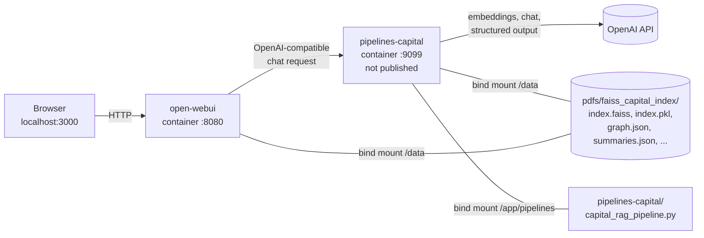
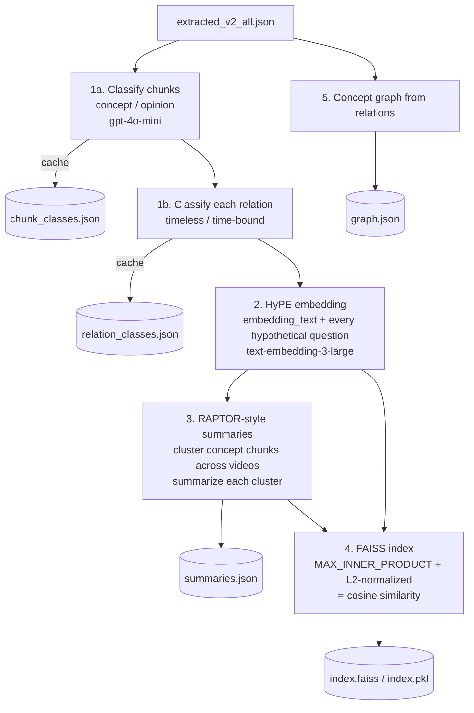
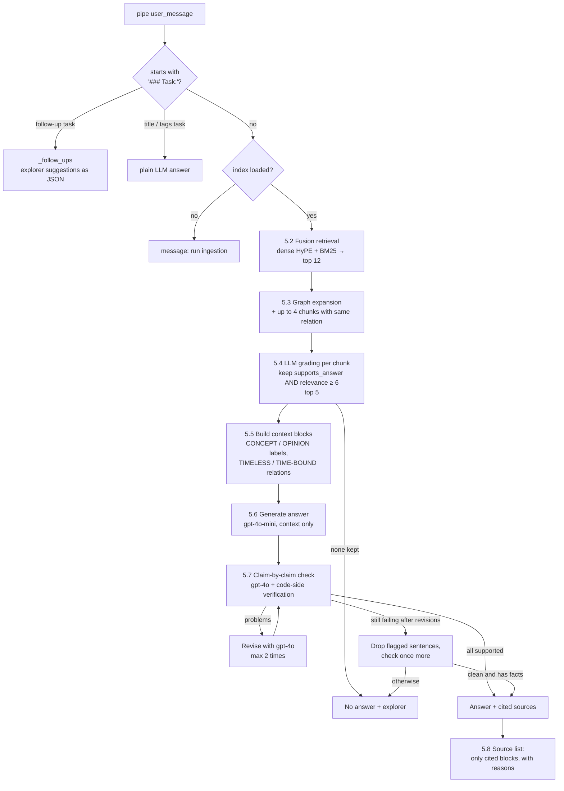
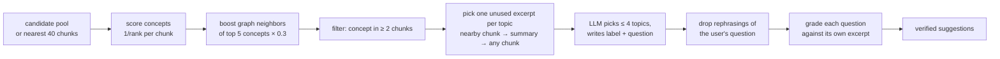

# Capital Markets RAG Pipeline

Technical documentation of the Capital Markets RAG pipeline: what it does, how data flows
through it, how it keeps the model from hallucinating, and what happens when a step fails.
For the design rationale behind each step, see [`CAPITAL_RAG_BEST_PRACTICES.md`](CAPITAL_RAG_BEST_PRACTICES.md).

| File | Role |
|------|------|
| [`pdfs/ingest_capital_chunks.py`](../pdfs/ingest_capital_chunks.py) | Offline ingestion: classification, embedding, summaries, concept graph |
| [`pipelines-capital/capital_rag_pipeline.py`](../pipelines-capital/capital_rag_pipeline.py) | Query-time pipeline served to Open WebUI |
| [`pdfs/generate_start_suggestions.py`](../pdfs/generate_start_suggestions.py) | Builds verified start-page questions |
| [`pdfs/apply_start_suggestions.py`](../pdfs/apply_start_suggestions.py) | Writes those questions onto the model in Open WebUI |
| [`all_rag_techniques_runnable_scripts/`](../all_rag_techniques_runnable_scripts/) | Reference implementations the pipeline is adapted from |

---

## Contents

1. [What the pipeline is for](#1-what-the-pipeline-is-for)
2. [Deployment architecture](#2-deployment-architecture)
3. [Source data](#3-source-data-extracted_v2_alljson)
4. [Offline ingestion](#4-offline-ingestion)
5. [Query-time workflow](#5-query-time-workflow)
6. [Hallucination defenses](#6-hallucination-defenses)
7. [Fallbacks and failure handling](#7-fallbacks-and-failure-handling)
8. [Explorer mode and follow-ups](#8-explorer-mode-and-follow-ups)
9. [Start-page suggestions](#9-start-page-suggestions)
10. [Configuration (Valves)](#10-configuration-valves)
11. [Operations](#11-operations)
12. [Cost and latency](#12-cost-and-latency)
13. [Known limitations](#13-known-limitations)
14. [Mapping to RAG techniques](#14-mapping-to-rag-techniques)

---

## 1. What the pipeline is for

The pipeline answers questions over transcribed videos by one capital-markets creator (mostly German).
That material is hard to answer from safely:

- **Evergreen explanations and time-bound opinions are mixed together.** "Rising rates push bond
  prices down" stays true. "I expect the DAX to fall in May" goes stale. If an old forecast is
  presented as a current fact, a user may act on outdated advice.
- **The same concept is explained many times** across different videos, in slightly different words.
- **LLMs like to fill gaps with textbook knowledge.** That knowledge may be correct, but it is not
  what the creator said, so it cannot be cited.

The design follows from that:

> **Every factual statement shown to the user must be backed by a verbatim quote from the
> retrieved sources, and every time-bound opinion must name the video it came from.
> If that cannot be guaranteed, the pipeline refuses and suggests related topics it *can* answer.**

---

## 2. Deployment architecture



- **`pipelines-capital`** is a separate instance of `ghcr.io/open-webui/pipelines` (see
  [`docker-compose.yaml`](../docker-compose.yaml)). It mounts `pipelines-capital/` as
  `/app/pipelines`, so `capital_rag_pipeline.py` is loaded automatically on startup. Valve values
  saved in the UI are persisted to `pipelines-capital/capital_rag_pipeline/valves.json`.
- The **index is not built in the container at startup.** It is created once, offline, by
  `ingest_capital_chunks.py` and read from `/data/faiss_capital_index`.
- `OPENAI_API_KEY` comes from `.env` through `${OPENAI_API_KEY}` in the compose file.
- Open WebUI's `PIPELINES_URL` points only at the climate pipelines server. **You have to add the capital
  server as a second connection yourself**: *Admin Panel → Settings → Connections → OpenAI API → +*
  with URL `http://pipelines-capital:9099` and the Pipelines API key (`PIPELINES_API_KEY` from `.env`). The pipelines
  ports are not published on the host, since the key allows uploading and running Python code.
- In the model picker, the model appears as **"Capital Markets RAG"** with model id
  `capital_rag_pipeline`.

### Pipeline lifecycle

| Hook | What it does |
|------|--------------|
| `__init__` | Creates the valves and empty state. Does no I/O. |
| `on_startup` | `_load()`: loads FAISS, builds the BM25 index, loads `graph.json`, and creates the LLM clients. |
| `on_valves_updated` | Runs `_load()` again, so valve changes take effect without a restart. |
| `pipe(...)` | Called for every chat request, including Open WebUI's background tasks. |

---

## 3. Source data: `extracted_v2_all.json`

Ingestion starts from `pdfs/faiss_capital_index/extracted_v2_all.json`. This file is the source of truth.
It is created **outside this repository** (transcript chunking and extraction) and is git-ignored together
with the rest of the index directory. Each element is one chunk:

| Field | Type | Used for |
|-------|------|----------|
| `id` | int | Unique chunk id, used as `chunk_id` |
| `chunk_type` | str | Stored in metadata (summaries get `"summary"`) |
| `title` | str | Display, BM25, grading prompt |
| `content` | str | Full text, stored as the document `page_content` |
| `embedding_text` | str | Primary vector, also used for clustering |
| `hypothetical_questions` | list[str] | One extra vector each (HyPE) |
| `concepts` | list[str] | BM25, graph nodes, explorer topics |
| `relations` | list[obj] | Cause → effect edges: `source`, `target`, `direction`, `time_horizon`, `mechanism`, `conditions` |
| `conditions` | str | Shown in the context block |
| `evidence` | str | Stored in metadata |
| `market_domain` | list[str] | Start-suggestion diversity |
| `sources` | list[str] | Video labels such as `"Live-Replay [948589646] (de-x-autogen) #1"` |

The video label format matters. `parse_video()` / `cite_source()` read
`Title [numeric-id] (lang) #n` or `Title_transcript #n` from it, to attribute opinions and to check
those attributions.

---

## 4. Offline ingestion

```sh
docker exec -it open-webui-pipelines-capital python /data/ingest_capital_chunks.py
docker restart open-webui-pipelines-capital
```



### 4.1 Concept / opinion classification

Every chunk gets a `content_class`:

- **concept**: evergreen teaching content (how instruments work, general mechanisms, principles).
- **opinion**: anything time-bound (market views, forecasts, positioning, trade ideas, commentary
  on recent moves).

**Mixed chunks count as opinion.** The prompt says so explicitly, because showing a stale view as
timeless is the worse mistake of the two.

Results are cached in `chunk_classes.json`, keyed by chunk id plus a SHA-256 of `title + content`.
A rerun only classifies new or changed chunks. The cache is written after every batch of 250, so an
interrupted run resumes where it stopped.

### 4.2 Relation classification

An opinion chunk can still contain a general mechanism. Each relation is therefore classified separately
as **timeless** or **time-bound** and cached in `relation_classes.json`. Relations are sent **one per
request** on purpose: batching 25 per request agreed with single requests only 17 of 50 times.
The prompt also says that `time_horizon` (how fast an effect plays out) does *not* make a relation
time-bound.

At query time, this lets the answer state a timeless mechanism from an opinion chunk generally,
while the rest of that chunk stays attributed to its video.

### 4.3 HyPE embedding

Each chunk is indexed under several vectors: one for `embedding_text` and one for each
`hypothetical_questions` entry, which is typically 9–13 vectors per chunk. **Every vector points to the
same full chunk `content` and metadata.** The text that was embedded is kept as `matched_text`. A user
question then matches a pre-generated question in question space, but the retrieval result is always
the whole chunk. Query time de-duplicates hits by `chunk_id`.

### 4.4 Canonical summaries (RAPTOR-style)

Concept chunks that explain the same thing in different videos are merged into one canonical
"summary" node:

- **Clustering:** `AgglomerativeClustering` with cosine distance, average linkage and
  `distance_threshold = 1 − 0.73` on the primary (`embedding_text`) vectors. Unlike RAPTOR's GMM,
  this never forces unrelated chunks into a cluster. The `0.73` threshold was measured on this corpus:
  real cross-video repeats are at ~0.74 and above, while different topics start to mix at ~0.70.
- **A cluster counts only if** it has ≥ 2 members **from ≥ 2 different videos**.
- **Opinion chunks are never merged.**
- The summarizer prompt allows only statements from the passages, no outside knowledge, and requires
  any disagreement between them to be stated explicitly.
- Each summary gets `chunk_type: "summary"`, `content_class: "concept"`, the union of its children's
  concepts, domains and sources, and `support` = the number of children. It is embedded and added to the
  same FAISS index.

### 4.5 FAISS index

`FAISS.from_embeddings(..., distance_strategy=MAX_INNER_PRODUCT, normalize_L2=True)`. On unit vectors
the inner product **is** cosine similarity, so higher scores mean closer matches. These two settings are
not saved in `index.pkl`, so the pipeline passes them again when it loads the index.

### 4.6 Concept graph (`graph.json`)

- **Nodes** = concepts, each with the ids of the chunks that mention it.
- **Edges** = `(source, target, direction)` triples from chunk relations. `weight` = the number of chunks
  that assert the triple, and `evidence` lists each chunk with its mechanism, conditions, time horizon
  and relation class.

The graph is built from original chunks only. Summaries carry no relations.

### Output files (all in `pdfs/faiss_capital_index/`, all git-ignored)

| File | Produced by | Read by |
|------|-------------|---------|
| `index.faiss`, `index.pkl` | ingestion | pipeline |
| `graph.json` | ingestion | pipeline (graph expansion, explorer) |
| `summaries.json` | ingestion | `generate_start_suggestions.py` |
| `chunk_classes.json`, `relation_classes.json` | ingestion (cache) | ingestion |
| `start_suggestions.json` | `generate_start_suggestions.py` | `apply_start_suggestions.py` |

---

## 5. Query-time workflow



Each step sends an Open WebUI **status event** (`{"event": {"type": "status", ...}}`). The user sees
one progress line that updates in place above the answer, for example *"Durchsuche die Quellen …"*,
*"12 Kandidaten gefunden"*, *"Prüfe jede Aussage gegen die Quellen …"*. Status events are only sent for
streaming requests. If `SHOW_THINKING_LOG` is on, the full step log, including rejected claims, is also
written into a collapsible `<think>` block.

### 5.1 Request routing

Open WebUI sends its own background tasks to the chat model as prompts that start with `### Task:`.
The pipeline handles them differently from user questions:

- **Follow-up task** (regex `^### Task:\s*Suggest .*follow-up questions`): answered by the explorer (§8),
  not by the LLM, so follow-up chips only offer questions the index can answer.
- **Other tasks** (chat title, tags): passed directly to `gpt-4o-mini`.
- If either fails, the pipeline returns `{}` so Open WebUI does not break.

### 5.2 Fusion retrieval (`_fusion_candidates`)

Adapted from `fusion_retrieval.py`:

1. **Dense:** `similarity_search_with_score(query, k=FETCH_K=40)`. Hits with cosine `< MIN_SIMILARITY (0.35)`
   are dropped. A chunk's dense score is its **best** vector (HyPE de-duplication).
2. **Sparse:** BM25Okapi over one document per chunk = title + concepts + content + every `matched_text`.
   The tokenizer drops a German/English stopword list, because function words would otherwise match almost
   every chunk. Top 40 with score > 0.
3. **Fusion:** min-max normalize both score sets, then `ALPHA · dense + (1 − ALPHA) · bm25` with `ALPHA = 0.6`.
   A chunk found by only one retriever gets 0 for the other.
4. Keep the top `CANDIDATE_K = 12`.

BM25 recovers exact-term hits (tickers, product names) that fall below the dense threshold.

### 5.3 Graph expansion (`_graph_expand`)

For the top `GRAPH_SEED_K = 3` candidates, every relation `(source, target, direction)` they assert is
looked up in the graph. Other chunks asserting the **same** relation (usually from other videos) are
appended with fused score 0, up to `GRAPH_EXPAND_K = 4`. This brings in further explanations and
contrasting views of the same mechanism. They still have to pass grading.

### 5.4 LLM grading (`_grade`)

Every candidate (up to 16) is graded in parallel (`max_concurrency=8`) by `GRADER_MODEL` with
structured output:

```python
class Grade(BaseModel):
    relevance: int          # 0-10
    supports_answer: bool   # directly helps answer the question
    reason: str             # one sentence, in the question's language
```

A chunk is kept only if `supports_answer` **and** `relevance ≥ MIN_RELEVANCE (6)`. Kept chunks are sorted by
`(relevance, fused score)` and cut to `TOP_K = 5`. The `reason` is reused later in the source list.
This combines LLM reranking (`reranking.py`) with the relevance gate from reliable-RAG.

### 5.5 Context construction

Each kept chunk becomes a numbered block:

```
[2] Zinsen und Anleihepreise - OPINION (time-bound, stated in: Exklusiver Marktausblick_ Mai 2026 [123] #4)
<chunk content>
Relation [TIMELESS]: Leitzins -> Anleihepreise (negative, medium-term): Steigende Zinsen drücken ...
Relation [TIME-BOUND]: EZB -> Zinsen (down, short-term): Er erwartet ... Conditions: ...
Conditions: ...
```

Alongside the text, the code keeps for each block whether it is an opinion, its timeless mechanisms, and its
parsed `(title, video_id)` pairs. The code-side attribution check (§6.4) uses these.

### 5.6 Answer generation

`ANSWER_PROMPT` (with `LLM_MODEL`, temperature 0) requires the model to:

- use **only** the context, and say so when the context does not answer the question;
- cite blocks as `[1]`, `[2]` after every statement;
- add **no outside knowledge, not even textbook facts or explanations of mechanisms**; every "because …"
  must itself be stated in the context;
- keep the source's **degree of certainty** ("könnte" must not become "typischerweise");
- state no **cause → effect link** that the context does not state as such;
- state CONCEPT blocks generally, and **attribute OPINION blocks to their video in the same paragraph**.
  TIMELESS relation lines are an exception and may be stated generally;
- show disagreeing opinions from different videos **side by side** and never merge them into one
  conclusion.

### 5.7 Grounding check and revision loop (`_grounded_answer`)

With `CHECK_ANSWER_GROUNDING = True` (the default), the answer is generated in full and **not streamed**.
The user only sees it after it has passed the checks:

1. The checker (`CHECK_MODEL = gpt-4o`, deliberately stronger than the answer model) splits the answer into
   self-contained claims and returns, for each one: `kind` (fact/meta), a verbatim `quote`,
   `claim_cause` / `quote_cause` / `same_cause`, `supported`, and the `answer_sentence` it came from.
2. The code verifies each claim (§6.3, §6.4) and collects the problems.
3. If there are no problems, the answer is accepted.
4. Otherwise the reviser (also `gpt-4o`, because `gpt-4o-mini` tended to keep the flagged statement in new
   words) rewrites the answer using the problem list, and the check runs again. This repeats up to
   `MAX_REVISIONS = 2` times.
5. **Last resort:** the flagged sentences are cut out of the answer by fuzzy match (≥ 0.8 similarity),
   keeping the line and list structure. The remaining text is checked once more with the same bar. It is
   accepted only if no problems remain **and** it still contains at least one factual claim.
6. Otherwise the result is **no answer** (§7).

### 5.8 Output

- The answer text.
- **`Quellen:`**: only the blocks the answer actually cites, under their citation numbers. Each entry shows
  the type (*Konzept*, *Konzept, Zusammenfassung aus N Abschnitten*, or *Meinung (zeitgebunden)*), the
  videos, and `Relevanz X/10: <grader reason>`, which explains why the source was used.
- Explorer suggestions, if any were computed (§8).

---

## 6. Hallucination defenses

The defenses are layered. Each layer covers a different way the model can go wrong.

| # | Layer | Where | What it prevents |
|---|-------|-------|------------------|
| 1 | Concept/opinion tagging, with mixed chunks counted as opinion | ingestion | Stale forecasts presented as timeless facts |
| 2 | Per-relation timeless/time-bound tagging | ingestion | Losing general mechanisms that sit inside opinion chunks |
| 3 | Summaries limited to the passages, disagreements kept explicit | ingestion | Merged or invented summary content |
| 4 | Similarity threshold + LLM relevance gate | retrieval | Answering from loosely related chunks |
| 5 | Strict answer prompt | generation | Textbook knowledge, stronger certainty, invented causality |
| 6 | Claim-level LLM check with `gpt-4o` | verification | Unsupported claims slipped in by the answer model |
| 7 | **Code-side quote verification** | verification | A checker that invents or stitches together its evidence |
| 8 | **Code-side cause comparison** | verification | Effect attributed to the wrong cause |
| 9 | **Code-side video attribution check** | verification | Opinions presented without their video |
| 10 | Refuse instead of showing an unchecked answer | control flow | Any failure in the checks above leaking through |

### 6.1 Why the LLM check alone is not enough

An LLM checker can say "supported" and back it with a quote that is not in the context, or that joins two
unrelated sentences. The pipeline therefore **does not take the checker's word for it**. Several checks are
deterministic Python.

### 6.2 Claim rules in the check prompt

- Every reason ("weil …", "because …") is its own claim, and a sentence joined by "wobei", "und" or
  "während" is two claims.
- Claims must be self-contained ("dadurch", "dies" and similar are resolved), so each claim names its own cause.
- `meta` claims (only about what the sources do or do not cover, or only comparing claims from the context)
  need no quote. A meta claim that adds information counts as a fact.
- A fact is unsupported if it turns a possibility into a rule, links a cause and effect that the context only
  mentions separately, names a different cause than the quote, attributes a view to the wrong video, or
  merges views from different videos.

### 6.3 `quote_in_context`: the quote must really exist

```text
normalize: lowercase, strip all quote characters, collapse whitespace
reject   : quote shorter than 15 chars
reject   : more than 2 sentences
reject   : 2 sentences, unless the 2nd begins with an anaphor (sie, er, es, dies, diese, it, this, ...)
accept   : exact substring of the context
accept   : longest common block covers ≥ 90 % of the quote (tolerates minor copy differences)
```

Single-sentence quotes are enforced because **joining two sentences is the typical way a cause from one
sentence gets attached to an effect from another.** The anaphor exception covers
"Volatilität beschreibt das Risiko. Sie wird durch die Standardabweichung gemessen." Causal connectors
("dadurch", "deshalb") are deliberately *not* on the anaphor list.

### 6.4 Claim verdict logic (`_unsupported_claims`)

```text
has_evidence = (kind == meta) or quote_in_context(quote)

if supported and same_cause and not has_evidence and joins_sentences(quote):
    → "merges separate statements"   (each sentence exists, but they were glued together:
                                      the reviser splits them instead of deleting)
elif not (supported and has_evidence and same_cause):
    → "not stated in the sources"    (the reviser removes it)
elif kind == fact and required_videos(quote) is non-empty:
    if the paragraph containing answer_sentence names one of those videos: OK
    else → "missing video attribution"   (the reviser adds the video title)
else: OK
```

- **`required_videos`** finds every context block that contains the quote. If any of them is a CONCEPT
  block, or the quote matches a TIMELESS relation line, no attribution is needed. Otherwise the claim must
  name one of the opinion block's videos.
- **Why attribution is checked in code:** the checker rewrites claims to be self-contained and drops the
  "Im Video …" prefix it was supposed to look for. The code instead finds the answer **paragraph** that
  contains the claim (`paragraph_of`, by fuzzy overlap) and searches it for the video title (compared after
  removing all non-word characters, so `_` vs `:` does not matter) or for the numeric video id.
- The reviser is told to **delete** unsupported statements, not to replace them with
  "the sources don't explain that …". Such a sentence is itself a new claim about the sources, and is often
  wrong.

### 6.5 Example

> **Answer draft:** "Sinkende Zinsen steigern die Nachfrage nach Anleihen [1]."
> **Context [1]:** "Wenn Investoren Vertrauen zurückgewinnen, … steigt die Nachfrage."
>
> Checker: `claim_cause = "sinkende Zinsen"`, `quote_cause = "Vertrauen der Investoren"`,
> `same_cause = false` → *not stated in the sources* → the reviser removes the sentence.

---

## 7. Fallbacks and failure handling

| Situation | Behavior |
|-----------|----------|
| `index.faiss` missing at startup | Server still starts (`_load` does not raise). Every question gets a message with the ingestion command. |
| `graph.json` missing | Graph expansion is silently disabled. The explorer still works, without neighbor boosting. |
| No candidate passes the similarity threshold or BM25 | No grading. Goes straight to **no answer + explorer**. |
| Grader call fails for a chunk | That chunk is skipped (logged). The others continue. |
| No chunk passes grading | *"Keine relevanten Abschnitte gefunden"* → no answer + explorer |
| Answer still has unsupported claims after 2 revisions | Trim flagged sentences → re-check → otherwise no answer |
| **Grounding check raises an exception** (API error, invalid structured output) | **Refuse.** An unchecked answer is never shown when the check is enabled. |
| Answer passes but contains only meta claims ("the sources don't cover this") | Shown as is, plus explorer suggestions ("Die Quellen beantworten die Frage nicht"). |
| No grounded answer | Fixed German refusal text (`NO_ANSWER`) + explorer. The chunks that failed are excluded from the explorer excerpts. |
| Explorer fails | Logged. The refusal is shown without suggestions. |
| Background task fails | Returns `{}`. |
| `CHECK_ANSWER_GROUNDING = False` | Answer streams token by token **unchecked**. The status line says *"(ungeprüft)"*. |
| OpenAI rate limits (ingestion) | `max_retries=30` (LLM) / `10` (embeddings) with backoff, `MAX_CONCURRENCY = 4`, results cached every 250 items. |

Rejected claims and failures are `print`ed with the `[capital_rag]` prefix. `PYTHONUNBUFFERED=1` makes
them appear immediately in `docker logs -f open-webui-pipelines-capital`.

---

## 8. Explorer mode and follow-ups

The explorer turns "I don't know" into "here is what I *can* tell you about".



1. **Topic pool:** concepts of the retrieval candidates, weighted `1/(rank+1)`. If retrieval found nothing,
   the nearest 40 vectors are used regardless of threshold. Graph neighbors of the top 5 concepts get
   `0.3 ×` their score.
2. **Coverage filter:** a concept must appear in at least `EXPLORE_MIN_CHUNKS = 2` chunks, so the user is not
   sent to a one-off mention.
3. **Excerpt per topic**, first unused option from: a nearby chunk with that concept → its canonical summary →
   any chunk with it. At most `3 × EXPLORE_SUGGESTIONS` topics.
4. **LLM selection** (`GRADER_MODEL`): picks up to 4 topics and writes for each a label and a follow-up question
   that *the excerpt answers*. There are two prompt variants: "no answer, related topics" and
   "already answered, deepen or broaden".
5. **De-duplication:** `same_question()` drops suggestions that only rephrase the user's question. It uses a
   string ratio ≥ 0.75, or shared tokens weighted by BM25 IDF covering ≥ 75 % of the lighter question, so
   sharing a rare term such as "IPO" counts and sharing a common one such as "Daten" hardly does.
6. **Verification:** each suggested question is graded against its excerpt with the **same** `GRADE_PROMPT`
   and `MIN_RELEVANCE`. Only questions the pipeline can actually answer are shown.

**Delivery:**

- *No answer:* shown inline as **"Verwandte Themen, zu denen es Material gibt:"** and as clickable follow-up
  chips (`chat:message:follow_ups` event).
- *Answered:* suggestions are **computed lazily**. The pipeline stores the question, candidates and the chunks
  it cited in an in-memory LRU (`recent`, 50 entries). When Open WebUI then sends its follow-up background task,
  `_follow_ups` finds the most recent remembered question in the task prompt and runs the explorer with
  `answered=True`, excluding the chunks already used. The answer is therefore not delayed by the explorer.

---

## 9. Start-page suggestions

```sh
docker exec open-webui-pipelines-capital python /data/generate_start_suggestions.py
docker exec -w /app/backend open-webui sh -c 'WEBUI_SECRET_KEY="$(cat .webui_secret_key)" python /data/apply_start_suggestions.py'
# then reload the browser tab
```

- **Generate** (runs in `pipelines-capital`, imports `GRADE_PROMPT`, `Grade`, `tokenize` and the valves from the
  pipeline so the bar is identical): takes the best-supported summaries, alternates between market domains
  for variety, has the LLM write a German title, subtitle and question for 2 × `count` candidates, keeps only
  questions the grader confirms (`MIN_RELEVANCE`), de-duplicates by the first content word of the title, and
  writes `start_suggestions.json`.
- **Apply** (runs in `open-webui`, uses its backend models): sets `meta.suggestion_prompts` on the model entry
  `capital_rag_pipeline`. An existing entry keeps its other settings. A new entry is created with public read
  access.

---

## 10. Configuration (Valves)

Editable in *Admin Panel → Settings → Pipelines* (select the capital connection). Saving triggers
`on_valves_updated` → full reload.

| Valve | Default | Meaning |
|-------|---------|---------|
| `INDEX_DIR` | `/data/faiss_capital_index` | Index location inside the container |
| `EMBEDDING_MODEL` | `text-embedding-3-large` | **Must match** `--embedding_model` used at ingestion |
| `LLM_MODEL` | `gpt-4o-mini` | Answer generation and background tasks |
| `GRADER_MODEL` | `gpt-4o-mini` | Chunk grading and explorer |
| `CHECK_MODEL` | `gpt-4o` | Claim check and revisions |
| `FETCH_K` | 40 | Raw hits per retriever (before chunk de-duplication) |
| `MIN_SIMILARITY` | 0.35 | Cosine floor for dense hits |
| `ALPHA` | 0.6 | Dense weight in fusion (1 − ALPHA for BM25) |
| `CANDIDATE_K` | 12 | Fused candidates kept |
| `GRAPH_SEED_K` | 3 | Top candidates used as graph seeds |
| `GRAPH_EXPAND_K` | 4 | Max chunks added by graph expansion |
| `MIN_RELEVANCE` | 6 | Grader relevance floor (0–10) |
| `TOP_K` | 5 | Chunks in the final context |
| `CHECK_ANSWER_GROUNDING` | `True` | Turn off only for debugging. Answers are then unchecked. |
| `MAX_REVISIONS` | 2 | Rewrite attempts before trimming |
| `SHOW_THINKING_LOG` | `False` | Full step log in a collapsible `<think>` block |
| `EXPLORE_MODE` | `True` | Related-topic suggestions and follow-up chips |
| `EXPLORE_SUGGESTIONS` | 4 | Max suggestions |
| `EXPLORE_MIN_CHUNKS` | 2 | Min chunks per suggested concept |

Ingestion flags: `--index_dir`, `--chunks`, `--embedding_model`, `--llm_model`, `--cluster_similarity` (0.73).

### Tuning hints

- **Too many refusals:** lower `MIN_RELEVANCE` to 5, or raise `TOP_K`/`CANDIDATE_K`. Turn on `SHOW_THINKING_LOG`
  first to see whether retrieval or the claim check is rejecting things.
- **Exact names or tickers not found:** lower `ALPHA` (more BM25 weight).
- **Off-topic chunks reaching the grader:** raise `MIN_SIMILARITY`.
- **Do not** change `EMBEDDING_MODEL` without re-running ingestion with the same model. Vectors from different
  embedding spaces produce meaningless similarities.

---

## 11. Operations

```sh
# first setup
cp .env.example .env                       # set OPENAI_API_KEY and PIPELINES_API_KEY
docker compose up -d --build
# put extracted_v2_all.json into pdfs/faiss_capital_index/
docker exec -it open-webui-pipelines-capital python /data/ingest_capital_chunks.py
docker restart open-webui-pipelines-capital
# add connection http://pipelines-capital:9099 in Open WebUI (see §2)

# debugging
docker logs -f open-webui-pipelines-capital        # [capital_rag] lines: rejected claims, failures
```

After editing `capital_rag_pipeline.py`, restart the `pipelines-capital` container. After changing the source
JSON, re-run ingestion. Only new or changed chunks and relations are re-classified, but embedding always runs
in full.

---

## 12. Cost and latency

Approximate OpenAI calls per user question with the default valves:

| Step | Model | Calls |
|------|-------|-------|
| Query embedding | text-embedding-3-large | 1 (+1 if the explorer falls back to nearest neighbors) |
| Grading | gpt-4o-mini | ≤ 16 (parallel, 8 at a time) |
| Answer | gpt-4o-mini | 1 |
| Claim check | **gpt-4o** | 1–4 (initial + up to 2 after revisions + 1 after trimming) |
| Revision | **gpt-4o** | 0–2 |
| Explorer | gpt-4o-mini | 1 selection + ≤ 4 grading (only on no answer or the follow-up task) |
| Title / tags tasks | gpt-4o-mini | 1 each |

The happy path is roughly 1 embedding, ~16 small grading calls, 1 answer and 1 `gpt-4o` check. Because the
answer is checked before it is shown, the user waits for the whole sequence. The status line covers that wait.

---

## 13. Known limitations

- **No conversation memory in retrieval.** Only the latest `user_message` is used for retrieval and answering.
  Follow-ups such as "and why?" are not rewritten into standalone questions.
- **German user-facing strings.** Status lines, refusal text and source labels are hard-coded in German. The
  answer itself follows the question's language.
- **In-memory follow-up state.** `recent` is lost on restart and is per process. Matching the follow-up task
  to a question uses `rfind` of the question text in the task prompt.
- **Grounding is lexical.** Quotes are verified by string matching. A claim that correctly paraphrases a source
  spread over several sentences may be rejected (this is the intended trade-off: false refusals over false
  claims).
- **`allow_dangerous_deserialization=True`.** `index.pkl` is a pickle. Only load indexes you built yourself.
- **Source JSON is produced outside this repo.** The extraction step that creates `extracted_v2_all.json` is
  not part of this repository.
- `docker-compose.yaml` uses absolute Windows host paths for volumes. Adjust them on other machines.
- Minor code notes: `self.explorer` is set in `_load()` but not initialized in `__init__`. A comment in
  `ingest_capital_chunks.py` refers to `CAPITAL_EMBEDDING_MODEL`, but the valve is named `EMBEDDING_MODEL`.

---

## 14. Mapping to RAG techniques

| Technique (reference script) | How it is used here |
|------------------------------|---------------------|
| `HyPE_Hypothetical_Prompt_Embeddings.py` | Multiple question vectors per chunk, resolving to the full chunk |
| `fusion_retrieval.py` | Min-max normalized dense + BM25, `ALPHA`-weighted |
| `graph_rag.py` / `light_rag.py` | Concept graph for relation-based expansion and explorer neighbors |
| `raptor.py` | Cross-video concept summaries (agglomerative clustering instead of GMM) |
| `reranking.py` | 0–10 LLM relevance scoring |
| `self_rag.py` / `crag.py` (reliable-RAG ideas) | Relevance gate, claim-level hallucination check, refusal |
| `explainable_retrieval.py` | Source list with the grader's reason for each source |
| `multi_faceted_filtering.py` | Concept/opinion and timeless/time-bound metadata driving answer rules |
